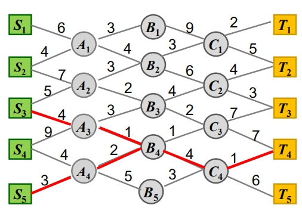
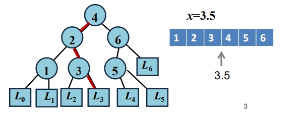

# 4. 动态规划

## 4.1 概述

### 动态规划基本思想

动态规划的实质是分治思想和解决冗余
贪心算法当前选择依赖已做出的选择，不依赖未做出的选择
分治算法各个子问题是独立的，不包含公共的子问题。

动态规划算法求解的问题的子问题往往不是相互独立的。
适用条件：问题需要满足优化原则，即：一个最优决策序列的任何子序列本身一定是相对于子序列的初始和结束状态的最优决策序列。

### 动态规划求解步骤

1. 分析最优解的性质
2. 递归定义最优值
3. 自底向上的方式计算最优值，并记录相关信息
4. 根据计算最优值时得到的信息，构造出最优解

### 动态规划基本要素

1. 最优子结构性质：问题的最优解包含子问题的最优解
2. 子问题重叠性质：递归求解时，相同的子问题出现多次
3. 自底向上的求解方法，先求子问题的最优解，然后规模一级一级放大，记录子问题最优解。

## 4.2 最短路径问题

问题：
输入：起点集合 { S1, S2, ..., Sn } ，
终点集合{T1, T2, ... , Tm}，
中间结点集，
边集 E，对于任意边 e 有长度
输出：一条从起点到终点的最短路



子问题：终点到最短路径上的任意一点的距离也是最短的。  
重叠：下一个点求解，依赖上一个解的结果
自底向上，重终点开始，向上搜索。先求每个 C 到每个 T 的的最短路径，再求每个 B 到每个 T 的最短路径，这一步会用到上一步的计算结果，直到计算出每个 S 到 T 的最短路径。

```
F(Ci) = min(Ci~Tj)
F(Bk) = min(Bk~Ci + F(Ci))
```

## 4.3 矩阵连乘问题

设 A1, A2 , … , An 为矩阵序列，
Ai 为 Pi-1 x Pi 阶矩阵，i = 1, 2, ... , n.
试确定矩阵的乘法顺序，使得元素相乘的总次数最少.
最优子结构分析：  
n 个矩阵的最佳计算顺序为(A1A2...Ak)(Ak-1...An)结果最优。总乘法次数 c = a + b + d; d = P[0]P[k]P[n], 两个子序列的惩罚次数结果不影响 d 的大小，如果第一个子序列的结果 a 不是最优的，则存在最优解 a', c' = a'+b+c 比 c 小，与 c 是最优的矛盾，a 也是最优的。  
递推方程：  
if i=j
m[i,j] = 0
if i<j
m[i,j]=min(m[i,k]+m[k+1,j]+P[i-1]P[k]P[j])

Ai...Ak = P[i-1]P[k]
动态规划算法
求矩阵 A1,A2,A3,A4,A5 的最优解

```
计算两个矩阵相乘的最优解，m[1][2], m[2][3], m[3][4], m[4],[5]
利用递推公式计算3个矩阵相乘的最优解m[1][3],m[2][4], m[3][5]
计算4个矩阵相乘的最优解m[1][4],m[2][5]
计算5个矩阵相乘的最优解m[1][5]
```

```c
算法 MatrixChain(P,n)
令所有的m[i,j]=0
//从2个矩阵最优解到n个矩阵最优解（不同规模的最优解）
for r = 2 to n do
    //子问题，k的位置遍历，保存最小的值
    for i = 1 to n-r+1 do
        j = i+r-1
        m[i,j] = m[i,j-1]+P[i-1]*P[j-1]*P[j]    // 先生成第一个结果，否则下面的判断if t<m[i,j] 出错
        s[i,j] = i
        for k = i to j-1 do     //遍历k，找到最小的位置
            t = m[i,k] + m[k+1,j] + P[i-1]*P[k]*P[i]
            if t<m[i,j]
                then m[i,j] = t   //更新解
            s[i,j] = k
```

时间复杂度 O(n^3)

## 4.4 最长公共子序列问题

如
X = ['a','b','c','b','d','a','b']
Y = ['b','d','c','a','b','a']
X 和 Y 的最长公共子序列 Z = ['b','c','b','a']

### 最优子结构性质：

若 Z[k] = X[m] = Y[n], 则，Z[0:k-1]是 X[0:m-1]和 Y[0:n-1]的最长公共子序列  
若 X[m] != Y[n], X[m] != Z[k] 则 Z[0:k]是 X[0:m-1]和 Y 的最长公共子序列  
若 X[m] != Y[n], Y[n] != Z[k] 则 Z[0:k] 是 X 和 Y[0:n-1]的最长公共子序列

### 递推关系

c[i][j]表示序列 Xi 和 Yj 的最长公共子序列  
将第一行和第一列设置为 0，序列 X，Y 从 1 开始

```python
c[i][j]= 0 when i=0 or j = 0
c[i][j]= c[i-1][j-1]+1 when i,j>0 and xi = yi
c[i][j]= max(c[i][j-1],c[i-1][j]) when i,j>0 and xi != yi
```

```java
public void maxCommonSubsequence(String[] x, String[] y) {
  int m = x.length+1;
  int n = y.length+1;
  int[][] c = new int[m][n];
  int[][] b = new int[m][n];
  for(int i = 1; i< m; i++) {
    for(int j = 1; j < n; j++) {
      if(x[i-1] == y[i-1]) {
        c[i][j] = c[i-1][j-1] +1;
        b[i][j] = 1;
      } else {
        if(c[i][j-1] > c[i-1][j]) {
          c[i][j] = c[i][j-1];
          b[i][j] = 2;
        } else {
          c[i][j] = c[i-1][j];
          b[i][j] = 3;
        }
      }
    }
  }
  System.out.printf("max length: %d %n", c[m-1][n-1]);
}
```

## 4.5 加工顺序问题

有 n 个工件在 M1 和 M2 机器上加工，加工顺序为先 M1,后 M2, t1j, t2j 分别为工件 j 在及机器 M1,M2 上的加工时间，求最短加工时间的工件加工顺序。

## 4.6 0-1 背包问题

一个旅行者随身携带一个背包. 可以放入背包的物品有 n 种, 每种物品的重量和价值分别为 wi , vi .  
如果背包的最大重量限制是 b, 每种物品可以放多个. 怎样选择放入背包的物品以使得背包的价值最大 ?  
不妨设上述 wi , vi , b 都是正整数.

#### 约束条件

    sum(wi*xi)<=b
    xi in [0,1]

#### 目标函数

    max(sum(wi*vi))

令 C[i][j]表示子问题 sum(wk\*xk,k=[1~i])<=j,装入前 i 种物品总重量小于 j 时的最大价值。

### 优化函数的递推方程

    C[i][j] = C[i-1][j]     if j<wi   //总重量限制j比第i个物品重量小时，不装物品i
        = max(C[i-1][j],C[i-1][j-wi]+vi)  if j>=wi   // 能装物品i时，最大价值取装和不装i的最大值

### 判断函数

判断第 i 个物品是否要装入

xi = 0, j = j when C[i][j]=C[i-1][j] 装前 i 种物品和装前 i-1 种物品，重量限制 j 时的最大价值相等，不装 i  
xi = 1, j = j-wi when C[i][j]>C[i-1][j]

### 算法设计

```c
算法 Knapsack(P,n)
输入：物品重量w[n],物品价值v[n]
输出: 物品是否放入背包x[n]
1. C
2.
3.
4.
5.

```

## 4.7 最优二叉查找树

二叉树检索办法：  
x 元素与结点比较，小于，则递归进入左子树，大于，递归进入右子树，等于，输入 x

对于集合 S 为从小打大排序的 n 个元素[x1,x2,x3,xn]
这些元素存储在二叉树的结点上，查找 x 是否在这些数中，如果不在，在 x 的间隙中（图中的方结点）



n 个元素的间隙为  
(x0,x1),(x1,x2),...,(x(n-1),xn),(xn,x(n+1))  
x0 = -infy, xn+1 = +infy  
x 在 xi 的概率为 bi  
x 在(xi,xi+1)的概率为 ai  
S 的存取概率分布为  
P=[a0,b1,a1,b2,...,bn,an]
平均比较次数为  
t = sum(bi(1+d(xi))) + sum(aj\*d(Lj))

d(xi)是 xi 结点在树种的深度，
d(Lj)是间隙 Lj 的深度，
到间隙时，只需要和上一层结点比较就可以确定，所以不用+1

求一颗最优的(平均比较次数最少的)二分检索树

#### 子问题划分

xk 作为根，他的两个叶节点为 S[i,k-1],S[k+1,j]

设 m[i,j]是输入 S[i,j]和 P[i,j]的最优二叉搜索树的比较次数

#### 递归方程

m[i,j] = min(m[i,k-1]+m[k+1,j]+w[i,j]) 1<=i<=j<=n
m[i,i-1] = 0

where w[i,j] = sum(P[i,j])

## 4.8 其他

### 买卖股票最佳时机

给定一个数组，它的第 i 个元素是一支给定的股票在第 i 天的价格。
设计一个算法来计算你所能获取的最大利润。你最多可以完成   两笔   交易。
注意：你不能同时参与多笔交易（你必须在再次购买前出售掉之前的股票）。

最优子结构：两次交易，每次交易收益是最大的, 卖出时，利润需要>0
重叠：每次交易的利润需要加上上次交易的结果
自底向上：计算总利润，需要先计算每次交易的利润。

输入：[3,3,5,0,0,3,1,4]

```java
class Solution {
  public int maxProfit(int[] prices) {
    int buy1 = -prices[0];
    int sell1 = 0;
    int buy2 = -prices[0];
    int sell2 = 0;
    for(int i = 0; i < prices.length; i++) {
      buy1 = max(buy1, -prices[i]); //价格更低，则买入
      sell1 = max(sell1, buy1+prices[i]); //卖出利润更大，则卖出
      buy2 = max(buy2, sell1-prices[i]);
      sell2 = max(sell2, buy2+prices[i]);
    }
    return sell2;
  }
```
