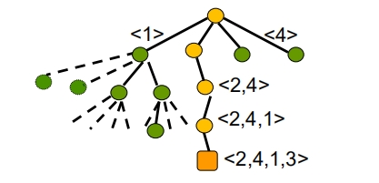
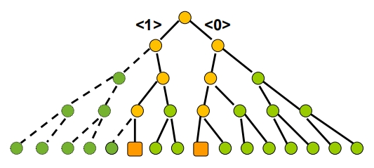

# 5. 搜索法
## 5.1 穷举搜索
## 5.2 深度优化搜索
## 5.3 回溯法

#### 4后问题：   
在4x4的方格棋盘上放置4个皇后，使没有两个皇后在同一列，同一行，以及45度方向，有多少种方法？   
解是4维向量如<2,4,1,3>表示在每一列的位置   
搜索空间：4叉树   
   
每个节点有4个儿子，分别代表1,2,3,4列位置，判断是否满足条件，不满足开始回到上一个节点继续循环。

#### 0-1背包问题   
  

父节点表示每个物品，子节点1,0表示选择，或者不选择，父节点依次是物品。   
#### 货郎问题
有n个城市，已知任意两个城市之间的距离，求每个城市恰好一次的最短路径。

搜索空间: 排列树
从第一个城市开始，儿子是剩余的城市，直到最后一个城市。

#### 回溯算法的基本思想
  1. 适用：求解搜索问题和优化问题
  2. 搜索空间：树，节点对应部分解向量，可行解在树叶上
  3. 搜索过程：采用系统的方法隐含遍历搜索树
  4. 搜索策略：深度优先，宽度优先，函数优先，宽深优先
  5. 结点分支判定条件：满足约束条件-分支扩张向量，不满足-回溯到该结点的父节点
  6. 结点状态：动态生成。白结点-尚未访问，灰结点-正在访问该结点为根的子树，黑结点-该结点为根的子树遍历完成。
  7. 存储：当前路径

回溯算法的适用条件：   
多米诺性质   
P(x1,x2...xk+1)->P((x1,x2...xk) 0<k<n
k维向量不满足约束条件，扩张向量到k+1维仍不满足，可以回溯。
#### 回溯算法实现

递归实现
```c
算法 ReBack(k)
if k>n then <x1,x2,...xn>是解
else while S[k] 非空 do
  x[k] = min(S[k])
  S[k] = S[k]-{x[k]}
  计算 S[k+1]
  ReBack(k+1)

算法 ReBacktrack(n)
输入n
输出： 所有解
for k=[1~n] 计算X[k], S[k]=X[k]
Reback(1)
```
迭代实现
```c
迭代算法 Backtrack
输入 n
输出 所有解
1. 对于i=[1~n] 求解X[i] //初始值
2. k=1
3. 计算 S[k]
4. while S[k]非空 do //满足约束，分支搜索
    x[k] = min(S[k]); S[k] = S[k]-{x[k]}
    if k<n then 
      k = k+1
    else
      [x[1],x[2],...,x[n]]是解
5. if k>1 then k = k-1; goto 4 //回溯
```
#### 装载问题
有n个集装箱，需要装上两艘载重分别为c1,c2的轮船，wi为第i个集装箱的重量，且w1+w2+..+wn<=c1+c2, 问是否存在一种合理的装载方案把这n个集装箱装上船？如果有，请给出一种方案。   
实例W=[90,80,40,30,20,12,10]   
c1 = 152, c2 = 130   
解：1 3 6 7装第一艘，其余装第2艘。
算法思想：令第一艘船的装入量为W1,    
1. 用回溯算法求使得c1−W1达到最小的装载方案.
2. 若满足w1+w2+...+wn−W1≤ c 则回答“Yes”,否则回答“No”

将W从大到小排列，依次将货物放入到c1船上，如果货物总重小于c1，进入左子树，继续下一个货物，如果总重大于c1，不放，进入右子树，直到所有货物判断结束，开始回溯，找到右子树没有走过的结点，进入右子树，如此循环，找到所有可行解。

伪码：
```c
算法Loading(W,c1)
1. Sort(W)  //从大到小排列
2. B=c1; best = c1; i=1; //B为当前空隙，best为最小空隙
3. while i<=n do
4.    if 装入i后重量不超过c1
5.    then B = B-wi; x[i] = 1; i = i+1; //x[i]=1则第i个物品放入到c1船。
6.    else x[i]=0; i=i+1;
7. if B<best then 记录解；best = B
8. Backtrack(i) //回溯
9. if i=1 then return 最优解。//回到根节点。
10. else goto 3

算法Backtrack(i)
while i>1 and x[i]=0 do //沿右分支一直回溯发现右分支边，或到根为止。
    i = i-1
if x[i]=1
then x[i]=0
    B = B+wi
    i = i+1
```
### 图的着色
输入：
无向连通图 G和 m 种颜色的集合用这些颜色给图的顶点着色，每个
顶点一种颜色. 要求是：G 的每条边的两个顶点着不同颜色. 
输出：所有可能的着色方案. 如果不存在着色方案，回答“No

设G=(V,E), V={1,2,...,n}   
颜色编号：1,2...m   
解向量: [x1,x2,...xn]∈{1,2,..,m}   
结点的部分向量[x1,x2,...xk]  
搜索树：m叉树, 树的分支（边）为颜色。
约束条件：在结点<x1, x2, ... , xk>处,顶点 k+1 的邻接表中结点已用过的颜色不能再用,
如果邻接表中结点已用过m种颜色，则结点 k+1没法着色，从该结点回溯到其父结点. 满足多米诺性质搜索策略：深度优先   
时间复杂度：O(n mn)

从第一个结点开始，先取第一种颜色，第二个结点取第一种颜色，判断不满足要求，取第二种颜色，直到达到最后一个结点，开始回溯。

## 5.4 宽度优先搜索
## 5.5 分支限界法
### 5.5.1 基本思想
#### 组合优化问题：  
目标函数（极大化或极小化）
约束条件（解满足的条件）
可行解: 搜索空间满足约束条件的解
最优解: 使得目标函数达到极大 (或极
小)的可行解  
#### 代价函数  
- 计算位置：搜索树的结点
- 值：极大化问题是以该点为根的子树所有
可行解的值的上界 ( 极小化问题为下界）
- 性质：对极大化问题父结点代价不小于子
结点的代价 (极小化问题相反)
#### 界
- 含义：当前得到可行解的目标函数
的最大值(极小化问题相反）
- 初值：极大化问题初值为 0 (极小
化问题为最大值) 
- 更新：得到更好的可行解时
#### 分支界限
1. 不满足约束条件
2. 对于极大化问题，代价函数值小于
当前界（对于极小化问题是大于界）

- 分支限界适用于组合优化问题
- 对结点<x1, ..., xk>定义代价函数
当前结点为根子树的可行解的上界
或下界
极大化问题与极小化问题的区别
- 定义界的初值
得到新的更好的可行解就更新界
### 5.5.2 最大团问题
### 5.5.3 货郎问题
### 5.5.4 圆排列问题
### 5.5.5 连续邮资问题
### 5.5.6 背包问题