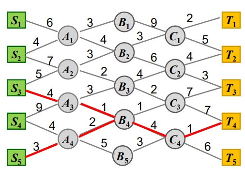

# 4. 动态规划
## 4.1 概述
### 动态规划基本思想

动态规划的实质是分治思想和解决冗余
贪心算法当前选择依赖已做出的选择，不依赖未做出的选择
分治算法各个子问题是独立的，不包含公共的子问题。

动态规划算法求解的问题的子问题往往不是相互独立的。
适用条件：问题需要满足优化原则，即：一个最优决策序列的任何子序列本身一定是相对于子序列的初始和结束状态的最优决策序列。

### 动态规划求解步骤

1. 分析最优解的性质
2. 递归定义最优值
3. 自底向上的方式计算最优值，并记录相关信息
4. 根据计算最优值时得到的信息，构造出最优解

### 动态规划基本要素

1. 最优子结构性质
2. 子问题重叠性质
3. 自底向上的求解方法

## 4.2 最短路径问题
问题：
输入：起点集合 { S1, S2, ..., Sn } ，
      终点集合{T1, T2, ... , Tm}，
      中间结点集，
      边集 E，对于任意边 e 有长度
输出：一条从起点到终点的最短路


## 4.3 矩阵连乘问题
设 A1, A2 , … , An 为矩阵序列，
Ai 为 Pi-1 x Pi 阶矩阵，i = 1, 2, ... , n. 
试确定矩阵的乘法顺序，使得元素相乘的总次数最少.
递推方程：
if i=j
      m[i,j] = 0
if i<j
      m[i,j]=min(m[i,k]+m[k+1,j]+P[i-1]P[k]P[j])

Ai...Ak = P[i-1]P[k]
动态规划算法
```c
算法 MatrixChain(P,n)
1. 令所有的m[i,j]=0
2. for r = 2 to n do
3.    for i = 1 to n-r+1 do
4.          j = i+r-1
5.          m[i,j] = m[i+1,j]+P[i-1]P[i]P[j]
6.          s[i,j] = i
7.          for k = i+1 to j-1 do
8.                t = m[i,k] + m[k+1,j] + P[i-1]P[k]P[i]
9.                if t<m[i,j]
10.               then m[i,j] = t
11.                     s[i,j] = k
```
时间复杂度O(n^3)

## 4.4最长公共子序列问题
## 4.5 加工顺序问题
## 4.6 0-1背包问题
## 4.7 最优二叉查找树
