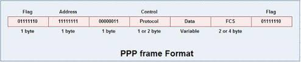
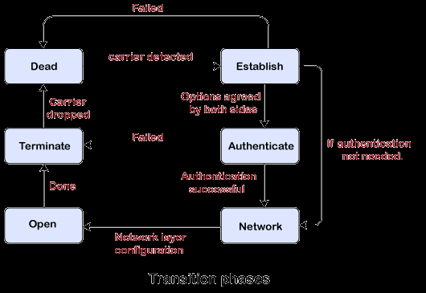

# 3. 数据链路层
## 3.1 使用点对点信道的数据链路层
链路：从一个结点到相邻结点的一段物理线路  
数据链路：物理线路+通信协议  
帧：点对点信道的数据链路层的协议数据单元  
IP简报：网络层协议数据单元

数据链路层通信步骤：
1. 结点A的数据链路层把网络层交下来的IP数据报添加首部和尾部，封装成帧
2. 结点A把封装好的帧发给结点B的数据链路层
3. 结点B的数据链路层判断收到的帧有无差错，无则把帧提取出IP数据报交给网络层。否则丢弃。

1. 封装成帧  
    - 由帧首部，帧的数据部分，帧尾部组成
    - 数据部分长度上限：最大传送单元MTU
    - 数据传输中断时，没有收到传输结束符（帧尾部）则丢弃
2. 透明传输  
    - 为防止数据部分有和帧首部字符或帧尾部相同的字符
    - 在数据部分和帧首部和尾部相同的字符前面添加一个转义字符ESC（称为字节填充）
3. 差错检查  
    - 差错类型：比特差错，帧丢失，帧重复，帧失序
    - 比特差错：循环冗余检验
    - 帧编号，确认和重传机制

## 3.2 点对点协议PPP Point to Point Protocol
### 3.2.1 PPP协议满足以下需求：
1. 简单
2. 封装成帧
3. 透明性
4. 多种网络层协议
5. 多种类型链路
6. 差错检查
7. 检测连接状态
8. 最大传送单元
9. 网络层地址协商
10. 数据压缩协商

### 3.2.2 PPP协议组成
1. 将IP数据报封装到串行链路的方法
2. 用来建立，配置和测试数据链路连接的链路控制协议LCP Link control protocol
3. 网络控制洗衣NCP Network control protocol

### 3.2.3 PPP协议的帧格式  
  
Flage标志字段是PPP帧开始的定界符。连续两个帧有一个Flage，当有两个连续的Flage时表示空帧。  
第2个和第3个字节没有实际意义。  
Protocol字段，为0x0021表示IP数据报，0xC021表示PPP链路控制协议的LCP的数据，0x8021表示这是网络层的控制数据。  
信息字段长度<=1500字节。

当信息部分有和Flage段一样的字符时，使用转义符0x7D,并使用**字节填充**
1. 信息段每个0x7E转为0x7D 0x5E
2. 信息段出现0x7D,转为0x7D 0x5D
3. 信息段出现ASCII码的控制字符（小于0x20),例如出爱心0x30(控制字符里表示传输结束)转为0x7D 0x23

**零比特填充**  
PPP协议在同步传输时，使用零比特传输填充方法实现透明传输。
Flag为01111110，发送端在数据段出现5个连续的1之后加上一个0
接收端把5个连续的1后的0删掉。

### 3.2.4 PPP协议工作状态
  

## 3.3 使用广播信道的数据链路层
局域网使用了广播信道。  

### 3.3.1 局域网的数据链路层
局域网分为星形网，环形网，总线网，总线网以传统的以太网最为出名，说到以太网就是指总线网。
使用双绞线的以太网速度已经达到了10Mbit/s,10Gbit/s 

#### 1. 以太网的两个标准
以太网用无源电缆作为总线传送数据帧。  
DIX Ethernet V2  
IEEE 802.3  
现在使用的主要是DIX Ethernet V2

#### 2. 适配器
计算机与外界局域网连接是通过通信适配器进行的，适配器也就是网卡，网络接口卡Network interface card.  
适配器实现数据的串行传输和并行传输的转换，能够实现以太网协议。  
适配器不适用计算机的CPU，当适配器收到正确的帧时，使用中断通知计算机。  
有差错的帧时直接丢弃。

### 3.3.2 CSMA/CD 协议
总线的特点：当一台计算机发生数据是，总线上所有计算机都能收到，在发送数据帧时首部写明接受者的地址，适配器判断是否是发给自己的，不是则丢弃。

以太网使用无连接的工作方式，是不可靠的交付  
为了解决多台计算机同时发送时的冲突，采用载波监听多点接入/碰撞检测协议CSMA/CD carrier sense multiple access with collision detection  

以太网采用曼彻斯特编码Manchester