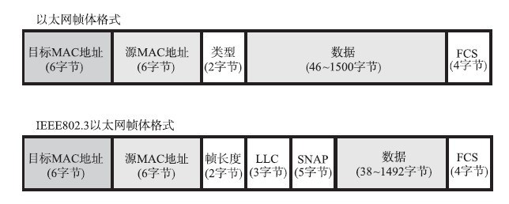

# 3. 数据链路层
## 3.1 使用点对点信道的数据链路层
链路：从一个结点到相邻结点的一段物理线路  
数据链路：物理线路+通信协议  
帧：点对点信道的数据链路层的协议数据单元  
IP简报：网络层协议数据单元

数据链路层通信步骤：
1. 结点A的数据链路层把网络层交下来的IP数据报添加首部和尾部，封装成帧
2. 结点A把封装好的帧发给结点B的数据链路层
3. 结点B的数据链路层判断收到的帧有无差错，无则把帧提取出IP数据报交给网络层。否则丢弃。

1. 封装成帧  
    - 由帧首部，帧的数据部分，帧尾部组成
    - 数据部分长度上限：最大传送单元MTU
    - 数据传输中断时，没有收到传输结束符（帧尾部）则丢弃
2. 透明传输  
    - 为防止数据部分有和帧首部字符或帧尾部相同的字符
    - 在数据部分和帧首部和尾部相同的字符前面添加一个转义字符ESC（称为字节填充）
3. 差错检查  
    - 差错类型：比特差错，帧丢失，帧重复，帧失序
    - 比特差错：循环冗余检验
    - 帧编号，确认和重传机制

## 3.2 点对点协议PPP Point to Point Protocol
### 3.2.1 PPP协议满足以下需求：
1. 简单
2. 封装成帧
3. 透明性
4. 多种网络层协议
5. 多种类型链路
6. 差错检查
7. 检测连接状态
8. 最大传送单元
9. 网络层地址协商
10. 数据压缩协商

### 3.2.2 PPP协议组成
1. 将IP数据报封装到串行链路的方法
2. 用来建立，配置和测试数据链路连接的链路控制协议LCP Link control protocol
3. 网络控制洗衣NCP Network control protocol

### 3.2.3 PPP协议的帧格式  
  
Flage标志字段是PPP帧开始的定界符。连续两个帧有一个Flage，当有两个连续的Flage时表示空帧。  
第2个和第3个字节没有实际意义。  
Protocol字段，为0x0021表示IP数据报，0xC021表示PPP链路控制协议的LCP的数据，0x8021表示这是网络层的控制数据。  
信息字段长度<=1500字节。

当信息部分有和Flage段一样的字符0x7E时，使用转义符0x7D,并使用**字节填充**
1. 信息段每个0x7E转为0x7D 0x5E
2. 信息段出现0x7D,转为0x7D 0x5D
3. 信息段出现ASCII码的控制字符（小于0x20),例如出爱心0x30(控制字符里表示传输结束)转为0x7D 0x23

**零比特填充**  
PPP协议在同步传输时，使用零比特传输填充方法实现透明传输。为了防止信息字段出现和标志字段相同的8比特组合  
Flag为01111110，发送端在数据段出现5个连续的1之后加上一个0
接收端把5个连续的1后的0删掉。

### 3.2.4 PPP协议工作状态
  

## 3.3 使用广播信道的数据链路层
局域网使用了广播信道。  

### 3.3.1 局域网的数据链路层
局域网分为星形网，环形网，总线网，总线网以传统的以太网最为出名，说到以太网就是指总线网。
使用双绞线的以太网速度已经达到了10Mbit/s,10Gbit/s 

#### 1. 以太网的两个标准
以太网用无源电缆作为总线传送数据帧。  
DIX Ethernet V2  
IEEE 802.3  
现在使用的主要是DIX Ethernet V2

#### 2. 适配器
计算机与外界局域网连接是通过通信适配器进行的，适配器也就是网卡，网络接口卡Network interface card.  
适配器实现数据的串行传输和并行传输的转换，能够实现以太网协议。  
适配器不适用计算机的CPU，当适配器收到正确的帧时，使用中断通知计算机。  
有差错的帧时直接丢弃。

### 3.3.2 CSMA/CD 协议
总线的特点：当一台计算机发生数据是，总线上所有计算机都能收到，在发送数据帧时首部写明接受者的地址，适配器判断是否是发给自己的，不是则丢弃。

以太网使用无连接的工作方式，是不可靠的交付  
为了解决多台计算机同时发送时的冲突，采用载波监听多点接入/碰撞检测协议CSMA/CD carrier sense multiple access with collision detection  

以太网采用曼彻斯特编码Manchester  
发送数据帧最多经过2倍的端到端的传播时延就能知道是否发送碰撞，把这个时间叫做争用期contention period,又称为碰撞窗口collision window。
以太网用截断二进制指数避退算法确定碰撞后重传的时机。碰撞后推迟一个随机的时间重传  
为了降低再次碰撞的概率，避退算法如下
1. 基本避退时间为争用期时间，为51.2微秒，争用期事件乘以以太网速度10Mbit/s=争用期内可以发送的数据。
2. 从离散整数集合中随机取出一个数，记为r,重传退后时间=r*争用期
3. 重传次数超过16次时丢弃该帧，向高层报告。

### 3.3.3 使用集线器的星形拓扑
使用集线器的加双绞线的方式性价比高，逐渐成为主流。  
集线器特点：
1. 逻辑上仍然是一个总线网
2. 有多个接口。
3. 集线器工作在物理层，不进行碰撞检测。
4. 集线器采用专门芯片，进行自适应回音消除，防止发送出的较强信号干扰接收到的较弱信号。

### 3.3.4 以太网信道利用率
发送一帧的总时间为发送碰撞的事件加上占用信道的时间，  
T0为发送帧需要的时间，当端到端传播时间t越短，则T0占总时间的比例越大，则利用率越高。  
定义了参数a=t/T0,a要尽可能小。

### 3.3.5 以太网的MAC层
1. MAC地址
硬件地址又称为物理地址或MAC地址
2. MAC帧格式
  

## 3.4 扩展的以太网
### 3.4.2 以太网交换机
以太网交换机能够并行工作，即插即用，内部有帧交换表（地址表，采用自学习算法建立），  
自学习方法：A发送一帧给B，先检查交换表是否有B的地址，没有，全部都发，B返回数据，将A和B的地址保存在交换表内。下次给B发送的时候，可以根据表内的地址直接发送。  
交换表有一定有效时间，过期删除，保证主机更换网络适配器或交换机接口更换主机的情况下能够正确使用。

## 3.5 高速以太网
1. 10BASE-T以太网，缩短网段的线缆长度，发送帧需要的时间T0降低10倍，从而保持a不变的情况下提高端到端传播时间t。
2. 吉比特以太网，
3. 10吉比特以太网，仅有全双工方式，不存在争用问题。

[next chapter](./4.NetworkLayer.md)
