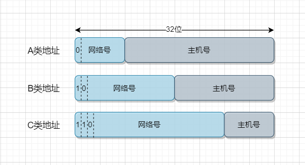
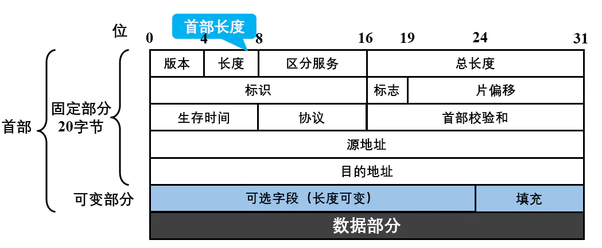
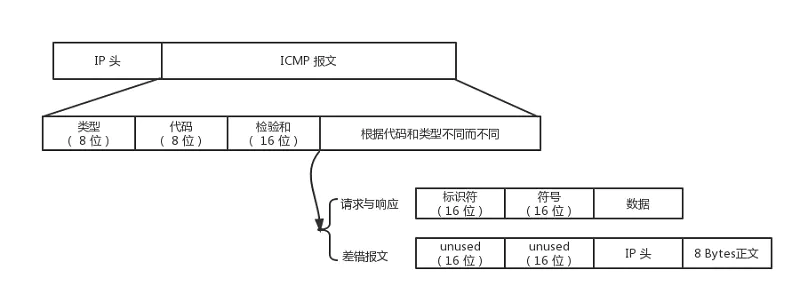

# 4. 网络层
## 4.1 网络层提供的两种服务
1. 面向连接，先建立连接，预留一切所需网络资源
2. 无连接，网络层向上只提供简单灵活的，无连接的，尽最大努力交付的数据报服务  

## 4.2 网际协议IP
IP协议配套使用的三个协议：
- 地址解析协议 ARP Address resolution protocol
- 网际控制报文协议ICMP Internet control message protocol
- 网际组管理协议IGMP Internet group management protocol

### 4.2.1 虚拟互联网
使用相同的网际协议IP（internet protocol)连在一起的性能各异的计算机网络，在网络层上看起来像是一个统一的网络，叫虚拟互联网，简称IP网，在IP网的上次使用TCP协议，就是现在的互联网Internet  
将网络连在一起的中间设备：
- 转发器repeater（物理层）
- 网桥或桥接器bridge（数据链路层）
- 路由器router（网络层使用）
- 网关gateway(网络层以上使用)
### 4.2.2 分类的IP地址
IP地址有网络号net-id(表示主机所连接到的网络)和主机号host-id(表示该主机)组成  
```IP地址::= {<net-id>,<host-id>}  ```
  
现在广泛使用无分类的IP地址
为了方便记忆，用等效的十进制表示，每8位加上一个点，叫做**点分十进制**  
IP地址特点
1. 路由器可以根据网络号转发分组，减小路由器所占存储空间和查表时间
2. 一台主机连接两个网络上时，具有两个IP地址，叫多归属主机multihomed host
3. 一个网络是具有相同网络号的主机的集合。用转发器或网桥连接起来的若干局域网仍为一个网络，不同网络号的局域网必须使用路由连接
4. 分配到网络号的网络都是平等的。
### 4.2.3 IP地址和硬件地址
硬件地址是数据链路层和物理层使用的地址，IP地址是网络层和以上各层使用的地址，是一种逻辑地址  
IP地址放在IP数据报的首部，硬件地址放在MAC帧的首部  
IP层抽象的互联网上只能看到IP数据报  
IP层抽象的互联网屏蔽了下层复杂的逻辑

### 4.2.4 地址解析协议ARP
AEP用来根据IP地址找到相应的硬件地址  
地址解析协议：在主机ARP高速缓存中存放一个从IP地址到硬件地址的映射表，并动态更新  
A主机给B主机发送IP数据报过程：
1. A现在ARP中看是否有B的IP地址，有，则找出对应的硬件地址，将硬件地址写入MAC帧，通过局域网发送到B
2. 否，A运行ARP进程，广播发送ARP请求，请求B的IP地址对应的硬件地址
3. 本局域网所有主机均收到，B主机向A主机响应分组，在响应中写入自己的硬件地址。
4. A将B的硬件地址写入自己的ARP高速缓存。
5. 如果B不在局域网内，则连接局域网的路由器响应，返回自己的硬件地址，路由接替A的工作，继续查找

### 4.2.5 IP数据报的格式
  
总长度单位字节。
数据报需要分片时，标识则复制到所有数据报片的标识字段中。  
标志：MF=1：还有分片，MF(more fragment)=0：最后一个分片，DF(Don't fragment)=0：允许分片  
片偏移：分片后，某片在原片中的相对位置，以8字节为偏移单位  
生存时间Time to live:每经过一个路由器TTL-1
协议：告诉目的主机的IP层将数据交给那个协议处理
首部校验和：将首部分为16位字的序列进行反码算术运算

###  4.2.6 IP层转发分组流程
分组转发算法：
1. 从数据报首部提取目的主机IP地址D，得出目的网络地址N
2. 如果N是此路由器直接连的地址，则直接交付，否则下一步
3. 如果路由表中有目的地址为D的特定主机路由，则传给下一跳路由，否则，下一步
4. 如果路由表中有到达网络N的路由，则传给下一跳路由
5. 如果表中有一个默认路由，传给默认路由，否则报告转发分组出错

## 4.3 划分子网和构造超网
### 4.3.1 划分子网subnetting
二级IP地址改为三级IP地址：
IP地址 ::= {<网络号>,<子网号>,<主机号>}

子网掩码：
使用子网掩码来判断三级网络。IP地址和子网掩码做与运算，得到子网地址。  
使用子网时分组转发，路由表包含三项：目的网络地址，子网掩码，下一跳地址
### 4.3.2 构造超网（无分类编址CIDR）
Classless Inter-Domain Routing特点：
1. 消除ABC及子网的概念，采用无分类的两级编址：IP地址::={<网络前缀>,<主机号>}，  
加"/"加上网络前缀所占的位数
2. 把网络前缀都相同的连续IP地址组成一个CIDR地址块。
路由表中利用CIRD地址块来查找目的网络，这种地址聚合称为路由聚合route aggregetion或构成超网supernetting

路由聚合减少了路由器之间的路由选择信息的交换，提高了互联网性能

网络前缀越短，则地址块所包含的地址数越多
在查找路由表时会得到不知一个匹配结果，应该从匹配结果中选择具有最长网络前缀的路由，叫做最长前缀匹配longest-prefix matching

使用二叉线索查找路由表：  
找出路由表中IP地址的唯一前缀，构造出二叉树。二叉树深度最大32，  
找到后将目的地址和叶节点的子网掩码进行与运算，看是否匹配。是则转发，否则就丢弃。  
为了提高检索速度，采用各种压缩算法。

## 4.4 网际控制报文协议ICMP
Internet control message protocol允许主机或路由报告差错情况和异常报告。  
ICMP装在IP数据报中，作为数据部分。
  

差错报告报文类型：
- 终点不可达
- 时间超过
- 参数问题
- 改变路由

询问报文：
- 回送请求或回答
- 事件戳请求或回答

## 4.5 互联网路由选择协议