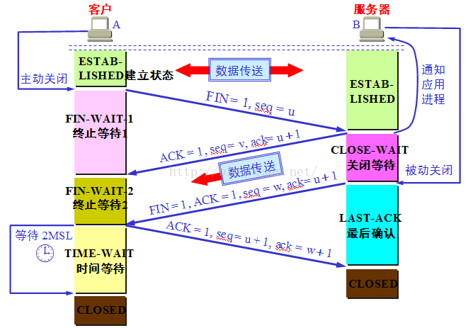

# 5. 运输层

## 5.1 概述

运输层向它上面的应用层提供通信服务，它属于面向通信部分的最高层，也是用户功能中的最低层。  
运输层功能：

1. 复用 multiplexing: 发送方不同进程同时使用一个运输层协议传送数据
2. 分用 demultiplexing：接受方在剥去报文的首部后能正确交付数据到目的进程

运输层提供应用程序间的逻辑通信。  
网络层为主机之间提供逻辑通信。

运输层的两个主要协议：

1. UDP User datagram protocol
2. TCP Transimission control protocol
   UDP 传输数据前不需要先建立连接，是不可靠传输，效率高。  
   TCP 提供面向连接的服务，需要建立连接，释放连接，不提供广播或多播服务，是可靠传输。

端口：

1. 服务器端使用端口号：熟知端口/系统端口 0~1023，例如 HTTP：80，HTTPS：443，FTP：21，登记端口号 1024~49151
2. 客户端使用端口号：49152~65535，客户进程动态选择。

## 5.2 用户数据报协议 UDP

UDP 特点：

1. 无连接的
2. 尽最大努力交付
3. 面向报文的，应用层报文加上 UDP 首部传给 IP 层
4. 没有拥塞控制，
5. 支持一对一，一对多，多对一，多对多的交互通信
6. 首部开销小，8 字节，TCP 有 20 字节

UDP 首部：

1. 源端口
2. 目的端口
3. 长度
4. 检验和，计算校验和时在数据报前增加伪首部(伪首部不向上或向下传)

## 5.3 传输控制协议 TCP

TCP 特点：

1. 是面向连接的运输层协议
2. 只能是一对一（点对点)的，只能有两个端点
3. 提供可靠交付的服务
4. 提供全双工通信（双方任何时候都可以发送数据，两端设有发送缓存和接受缓存）
5. 面向字节流，TCP 将应用层传下来的数据看做是字节流，不知道实际意义。

TCP 有两个端点，端点叫做套接字 socket, 端口号拼接到 IP 地址构成套接字。  
socket = (IP 地址:端口号)  
TCP 连接唯一的被通信两端的两个端点所确定。  
TCP 连接::={socket1, socket2} = {(IP1, port1),(IP2, port2)}

## 5.4 可靠传输控制协议

1. 停止等待协议：接收到对方确认再发送下一个分组
2. 连续 ARQ 协议，automatic repeat request 自动重传请求。每接受到一个确认，就把发送窗口向前滑动一个分组的位置。接受方采用累积确认，对按序到达的最后一个分组发送确认。

## 5.5 TCP 报文段的首部格式

## 5.6 TCP 可靠传输的实现

### 5.6.1 以字节为单位的滑动窗口

发送端 A 连续发送，接收端接 B 收到连续的字节后发送给 A 最大的位置，A 的发送窗口向前移动。当 B 的接受窗口前几个没按序收到，则一直不会给 A 发送通知，A 已经全部发完等待 B 通知，超时后重传。

## 5.7 TCP 的流量控制

流量控制 flow control 就是让发送方的发送速率不要太快，要让接收方来得及接收。
接收方通过给发送方发送接受窗口大小 receiver window，发送方地发送窗口大小不能超过接收方给出的接受窗口。  
当接受方 B 给发送方 A 发送零窗口报文后不久，B 有了存储空间，给 A 发送 rwnd = 400 的报文段，但这个报文段在传送过程中四丢失，B 在等待 A 的数据，A 在等待 B 的通知，发生死锁。  
为此 TCP 为每个连接设有一个持续计时器 persistence timer,当 A 收到零窗口通知，启动持续计时器，当超时，A 向 B 发送探测报文段。

## 5.8 TCP 的拥塞控制

在某个时间段，对网络中某个资源的需求超过了该资源所能提供的可用部分，网络性能变坏，这种情况叫拥塞 congestion:  
sum(对资源的需求)>可用资源  
TCP 拥塞控制算法：

1. 慢开始 slow-start
2. 拥塞避免 congestion avoidance
3. 快重传 fast retransimit
4. 快恢复 fast recovery

拥塞窗口 congestion window  
如何感知拥塞：

1. Loss 事件=timeout 或 3 个重复的 ACK
2. 发生 Loss 事件后，发送方降低发送速率  
   为了防止拥塞窗口 cwnd 增长过大引起网络拥塞，设置一个慢开始门限 ssthresh 状态变量

## 5.9 TCP 的运输连接管理

运输连接的三个阶段：

1. 连接建立
2. 数据传送
3. 连接释放

主动发起 TCP 连接的应用进程叫客户，被动等待连接建立的应用进程叫服务器。  
TCP 连接的建立采用三报文握手机制，服务器要确认客户的连接请求，然后客户要对服务器的确认进行确认。  

TCP 的连接释放采用四报文握手机制，任何一方都可以在数据传送结束后发出连接释放的通知，待对方确认后就进入半关闭状态，当另一方也没有数据再发送时，则发送连接释放通知，对方确认后就完全关闭了 TCP 连接。

[next chapter](./6.ApplicationLayer.md)

总结：  
TCP 如何保证数据可靠性的：

1. 数据包：校验和
2. 数据包传输：序列号，确认应答，超时重传
3. 流量控制：拥塞控制

简述拥塞控制  
TCP 长连接和短连接的区别  
TCP 粘包、拆包及解决方法
