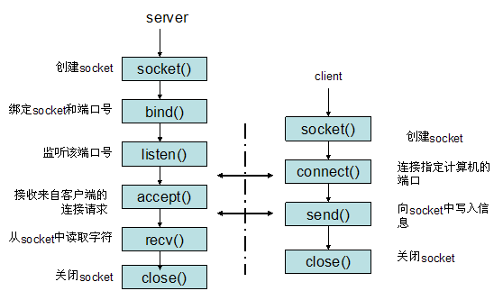

# 6. 应用层

## 6.1 域名系统 DNS

域名系统 Domain Name System 是互联网使用的命名系统，将便于用户使用的机器名称转换为 IP 地址。  
域名是不定长的，IP 地址是定长的，IPv4 是 32 位，IPv6 是 128 位。  
为提高 IP 地址查询效率，同时为了防止域名服务器故障就发生整个互联网瘫痪，采用分布式域名系统。

互联网的域名结构 0. 根

1. 顶级域名
   - 国家顶级域名 cn, us
   - 通用顶级域名 com net org int edu gov mil
2. 二级域名
   - 类别域名 ac com edu gov mil net org
   - 行政区域名 bj js sh
3. 三级域名
   - www mail pku ...
4. 四级域名
   - www mail ...

域名服务器：

1. 根域名 服务器 root name server
2. 顶级域名服务器 TLD
3. 权限域名服务器
4. 本地域名服务器 local name server

域名解析方法：

1. 迭代查询
   1. m.xyz.com 先向本地域名服务器递归查询，
   2. 本地域名服务器迭代查询。先向根域名服务器查询
   3. 根域名服务器高速本地域名服务器下一次应该查询的顶级域名服务器 dns.com 的 IP
   4. 本地域名服务器向 dns.com 查询
   5. dns.com 告诉本地域名服务器下一次应该查询权限域名服务器 dns.abc.com
   6. 本地域名服务器向 dns.abc.com 查询，
   7. dns.abc.com 告诉本地域名服务器所查询的 IP 地址
   8. 本地域名服务器将 IP 地址告诉主机 m.xyz.com  
      为了提供效率，增加在域名服务器增加高速缓存，记录最近查询的地址，新的查询可能会跳过 1 到 8 的其中某些步骤
2. 递归查询
   查询 a 域名服务器，没有找到，则 a 域名服务器以客户的身份，向 b 域名服务器查询，找到后原路返回。

## 6.2 文件传送协议 FTP

## 6.3 远程终端协议

## 6.4 万维网 WWW World wide web

万维网是分布式超媒体 hypermedia 系统，它是超文本 hypertext 系统的扩充。  
超文本是包含指向其他文档链接的文本。

### URL: 统一资源定位符 Uniform resource locator

<协议>://<主机>:<端口>/<路径>  
http 端口默认 80,通常省略。  
http://www.baidu.com/map

### HTTP 超文本传送协议

WWW 工作过程

```
              |<------建立TCP连接--------->|
浏览器发出请求 |-------HTTP请求报文-------->|
              |<------HTTP响应报文---------| 服务器返回响应
              |<------释放TCP连接--------->|
```

代理服务器 Proxy server，又称为万维网高速缓存 web cache 将最近的请求和相应暂存在本地磁盘。

### HTTP 报文结构：

#### 1. 请求报文

```
方法 URL 版本 CRLF  //请求行
首部字段名: 值CRLF
...
首部字段名: 值CRLF
CRLF
实体主体（通常不用）
```

方法有以下几种

- OPTION
- GET
- HEAD
- POST
- PUT
- DELETE
- CONNECT

例如：

```
GET /dir/index.html HTTP/1.1
Host: www.xyz.edu.cn
Connection: close
User-Agent: Mozilla/5.0
Accept-Language: cn
```

#### 2. 响应报文

响应报文只有首行不同  
版本 状态码 短语 CRLF //状态行  
例如：HTTP/1.1 404 Not Found

状态码：

- 1xx 通知信息
- 2xx 成功，或接受或知道了
- 3xx 重定向，还需要进一步行动
- 4xx 客户差错
- 5xx 服务器差错

### Cookie

HTTP 是无状态的 stateless，因此可以使用 cookie 在本地记录用户身份，  
Cookie 工作流程：

1. 当用户使用 Cookie 访问某个网站时，服务器为这个用户生成一个唯一识别码
2. 服务器用这个识别码作为索引在后端数据库产生一个项目，
3. 服务器在 HTTP 响应报文添加 Set-cookie: 31dasdasdf 的首部行，后面的值为识别码
4. 客户浏览器在管理 Cookie 的文件中增加一行，包含主机名和识别码
5. 客户下次访问这个网站时，在 HTTP 请求报文中增加首部行 Cookei: 31dasdasdf

## 6.5 电子邮件

## 6.6 动态主机配置协议

## 6.7 简单网络管理协议

## 6.8 应用进程跨越网络的协议

API：Application programming interface 应用编程接口。
API 提供了标准的系统调用函数，应用程序只需要使用这些函数就可以得到系统服务。
TCP/IP 协议软件已驻留在操作系统中，Socket interface 套接字就是可以让应用程序使用 TCP/IP 的应用编程接口 API。

应用程序使用网络进行通信流程：

1. 进程发出 socket 系统调用请求
2. 系统分配给进程一些必要的系统资源（资源的总和称为 socket descriptor 套接字描述符）
3. 进程使用 socket descriptor 进行建立连接，收发数据，调整网络通信参数等操作
4. 通信完毕后通过 socket 的 close 系统调用通知系统回收资源。

系统调用：

1. 连接建立阶段
   - 创建 socket 后，将本地 IP 地址和熟知端口号 bind 到 socket 上，
   - 调用 listen, 以便随时接受客户服务请求
   - 调用 accept，将客户发来的连接请求提取出来。
   - 主服务器进程调用 accept 后，为每个新的连接请求创建一个新的 socket，并将 socket 的标识符返回给客户，并创建一个从属服务进程来处理这个 socket, 数据通信结束后，从属服务进程关闭这个 socket，同时这个从属服务进程也被撤销。
   - 客户服务调用 socket 创建套接字后，调用 connect 与远地服务器建立连接
2. 数据传送阶段
   - 客户和服务器都使用 send 传送数据。send 需要三个变量：要发往的 socket 的描述符，要发送的数据地址和，数据长度。
   - 都使用 recv 接收数据：需要三个变量：要使用的 socket 的描述符，缓存的地址，缓存空间的长度。
3. 连接释放阶段 - 调用 close 释放连接和撤销 socket
   

## 6.9 P2P 应用

[next chapter](./7.Security.md)
