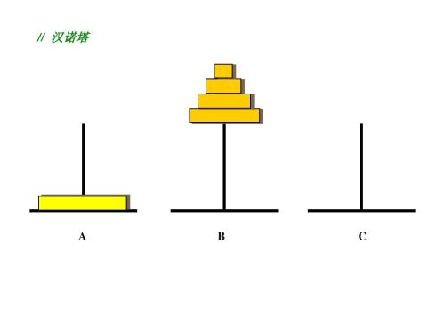

# 1. Basic

## 1.1 什么是数据结构

### 1.1.1 数据结构(Data Type)

包含数据对象在计算机中的**组织方式**及加在数据对象上的**操作**，以及实现这些操作的**最高效算法**

解决问题方法的效率与数据的组织方式、空间利用效率、算法巧妙程度有关。

### 1.1.2 抽象数据类型(Abstract Data Type)

- 数据类型
  - 数据对象集
  - 数据集合相关联的操作集
- 抽象：描述数据类型的方法不依赖于具体实现
  - 与存放数据的机器无关
  - 与数据存储的物理结构无关
  - 与实现操作的算法和编程语言均无关

只描述数据对象集和相关操作集“是什么”，并不涉及“怎么做到”的问题

## 1.2 算法 Algorithm

### 1.2.1 定义

- 算法是一个有限指令集
- 它接受一些输入（或无输入），产生输出
- 在一定有限步骤后终止
- 每条指令有充分明确目标，无歧义
- 在计算机能处理的范围内
- 不依赖于任何计算机语言及具体的实现手段

算法不是程序，程序可以无限运行，算法必须在有限步骤后终止

### 1.2.2 算法复杂度

### 1.2.3 复杂度的渐进表示法

## 1.3 应用实例：

### 1.3.1 最大子列和问题

给定 N 个整数的序列$\lbrace A_1,A_2,...,A_N \rbrace$,
求函数
$
f(i,j) = \max \lbrace {0, \displaystyle\sum_{k=i}^j A_k} \rbrace
$
的最大值

#### 算法 1

```python
int MaxSubseqSum1(int A[], int N)
{
    int ThisSum, MaxSum = 0;
    int i, j, k;
    for(i = 0; i < N; i++>){ /* i: position of left side */
        for(j = i; j<N; j++){ /* j: position of right side */
            ThhisSum = 0;
            for(k=i;k<j;k++)
                ThisSum += A[k];
            if(ThisSum>MaxSum)
                MaxSum = ThisSum;
        }
    }
}
```

#### 算法 2

```c
int MaxSubseqSum1(int A[], int N)
{
    int ThisSum, MaxSum = 0;
    int i, j, k;
    for(i = 0; i < N; i++>){ /* i: position of left side */
        ThhisSum = 0;
        for(j = i; j<N; j++){ /* j: position of right side */
            ThisSum += A[j]; /*i相同时，j+1时结果是上一次计算的结果加上下一个数，避免重复计算*/
            if(ThisSum>MaxSum)
                MaxSum = ThisSum;
        }
    }
}
```

#### 算法 3：分而治之

- 将序列从中分为两个子序列
- 递归求得两自列的最大和$S_{left}$和$S_{right}$
- 从中分点分头向左、右两边扫描，找出跨过分界线的最大子列和$S_{center}$
- $S_max = \max \lbrace S_{left}, S_{center}, S_{right} \rbrace$

```java
public class MaxSubSeqSum {
  public static void main(String[] args) {
    int[] list = { -2, 11, -4, 13, -5, -2 };
    System.out.println("input: " + Arrays.toString(list));
    System.out.printf("divide and conquer method: %d %n", divideMethod(list));
  }
  public static int divideMethod(int[] sequence) {
    return divideAndConquer(sequence, 0, sequence.length - 1);
  }
  public static int divideAndConquer(int[] list, int left, int right) {
    int center;
    int maxLeftSum, maxRightSum;
    int maxLeftBorderSum = 0;
    int maxRightBorderSum = 0;
    int leftBorderSum = 0;
    int rightBorderSum = 0;
    // 终止条件：当子列只有一个数字
    if (left == right) {
      if (list[left] > 0) {
        return list[left];
      } else {
        return 0;
      }
    }
    // 计算中间位置
    center = (left + right) / 2;
    maxLeftSum = divideAndConquer(list, left, center);
    maxRightSum = divideAndConquer(list, center + 1, right);
    // 求跨越分界线的最大子列和
    // 左边扫描
    for (int i = center; i >= left; i--) {
      leftBorderSum = leftBorderSum + list[i];
      if (leftBorderSum > maxLeftBorderSum) {
        maxLeftBorderSum = leftBorderSum;
      }
    }
    // 右边扫描
    for (int i = center + 1; i <= right; i++) {
      rightBorderSum += list[i];
      if (rightBorderSum > maxRightBorderSum) {
        maxRightBorderSum = rightBorderSum;
      }
    }
    System.out.printf("max left: %d, max right: %d, max center: %d %n", maxLeftSum, maxRightSum,
        maxLeftBorderSum + maxRightBorderSum);
    return max3(maxLeftSum, maxRightSum, maxLeftBorderSum + maxRightBorderSum);
  }
  //计算a b c 最大值。
  public static int max3(int a, int b, int c) {
    if (a > b) {
      return Math.max(a, c);
    } else {
      return Math.max(b, c);
    }
  }
}
```

#### 算法 4：在线处理

“在线”的意识是指每输入一个数据就进行即时处理，在任何一个地方终止输入，算法都能正确给出当前的解。

最大子和子列：{a_i, a_i+1, .. a_j} 总是有 sum(a_i ~ a_k) >=0;

证明，如果小于 0， 那么加下一个正数，值要比当个正数小，下一个单个正数是最大子列，和这个子列是最大子列矛盾。

```c
int MaxSubseqSum4(int A[], int N){
    int ThisSum, MaxSum;
    int i;
    ThisSum = MaxSum = 0;
    for(i = 0; i<N; i++){
        ThisSum += A[i];
        if(ThisSum > MaxSum)
            MaxSum = ThisSum;
        else if(ThisSum<0)
            ThisSum = 0;
    }
}
```

### 1.4 汉诺塔问题

在经典汉诺塔问题中，有 3 根柱子及 N 个不同大小的穿孔圆盘，盘子可以滑入任意一根柱子。一开始，所有盘子自上而下按升序依次套在第一根柱子上(即每一个盘子只能放在更大的盘子上面)。移动圆盘时受到以下限制:
(1) 每次只能移动一个盘子;
(2) 盘子只能从柱子顶端滑出移到下一根柱子;
(3) 盘子只能叠在比它大的盘子上。

请编写程序，用栈将所有盘子从第一根柱子移到最后一根柱子。

你需要原地修改栈。

示例 1:

输入：A = [2, 1, 0], B = [], C = []
输出：C = [2, 1, 0]



1. 将 n-1 个从 A 移动到 B，

2. 将 1 个从 A 移动到 C,

3. 将 n-2 个从 B 移动到 A,

4. 将 1 个从 B 移动到 C

5. 将 n-3 个从 A 移动到 B... 开始循环。

考虑边界条件：

当 A 上只有一个时，只需要从 A 移动到 C

```java
Class Hanota {
    public static void main(String[] args) {
        int a = {2, 1, 0};
        List<Integer> A = Arrays.stream(a).boxed().collect(Collectors.tolist());
        List<Integer> B = new ArrayList<>();
        List<Integer> C = new ArrayList<>();
        move(A.size(), A, C, B);
        System.out.println(C);
    }
    public static void move(int n, List<Integer> start, List<Integer> goal, List<Integer> temp) {
        if(n == 1) {
            goal.add(start.remove(start.size() - 1));
        } else {
            move(n-1, start, temp, goal);
            goal.add(start.remove(start.size() - 1));
            move(n-1, temp, goal, start);
        }
    }
}
```

### 1.5 用递推方法求集合的中位数

[next](2.LinearList.md)
