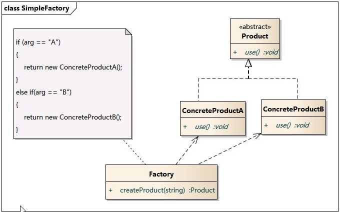
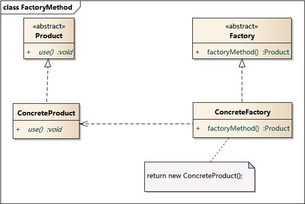
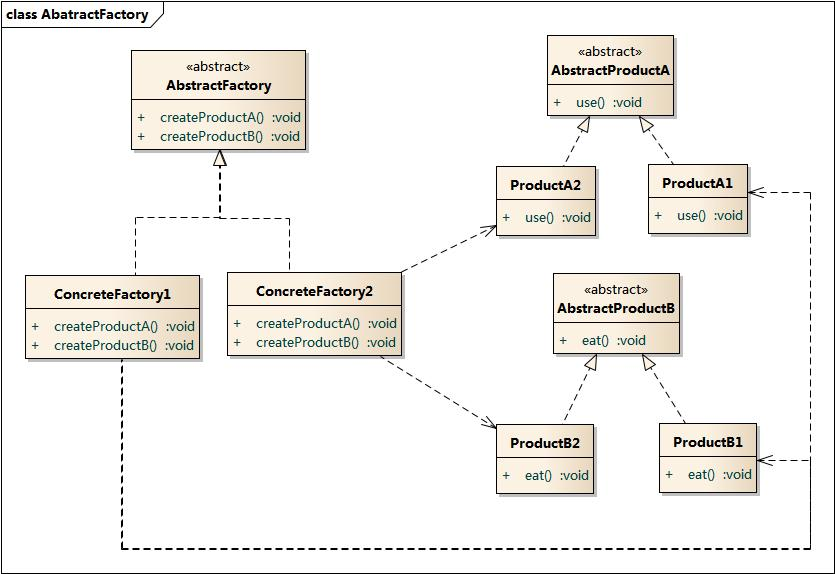
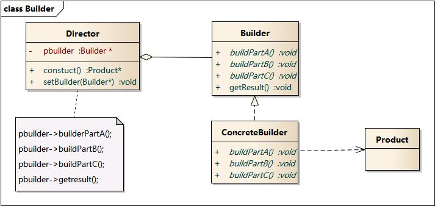

# 1. 工厂模式

## 1.1 简单工厂模式



## 1.2 工厂方法模式



## 1.3 抽象工厂模式



## 1.4 建造者模式



## 1.5 单例模式 Singleton

1. 意图：保证类仅有一个实例，并为之提供一个全局访问点。
2. 适用：
   - 类只能有一个实例，且客户可以从众所周知的访问点访问
   - 唯一的实例应该是通过子类化可拓展的，并且客户应该无需更改代码就能适用一个扩展的实例。
3. 实现要点：定义静态属性和操作

例如系统只能有一个正在打印的任务。


单例模式没有抽象层，扩展困难。

```java
public class Singleton{
   private static volatile Singleton singleton;
   private Singleton(){};
   public static getInstance() {
      if(singleton == null) {
         synchronized (Singleton.class) {
            if(singleton == null) {
               singleton = new Singleton();
            }
         }
      }
      return singleton;
   }
}
```

- 持有一个静态属性，自己的一个实例。
- getInstance 方法检查实例是否为空，不为空返回实例，为空的话创建一个实例。检查两次是否为空，第一次为了提高不为空时的检查效率，第二个保证只有一个线程进行了实例化。
- 实例被 volatile 修饰，为了防止两个线程同时检测到为空，一个线程实例化完成后，第二个线程由于读取到的是缓存内的数据，所以还是空，则会被再次实例化，加上 volatile 保证是在方法区读取静态变量。
- 构造函数为私有的

[Next page](2.StructuralPattern.md)
