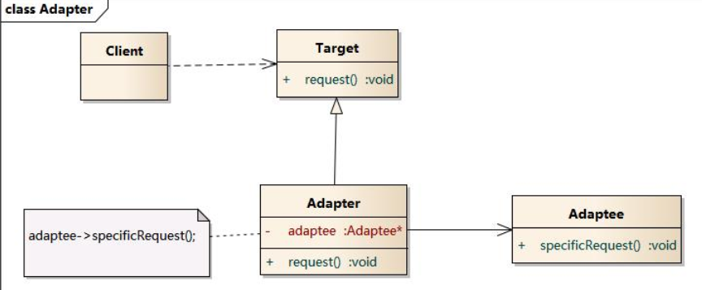
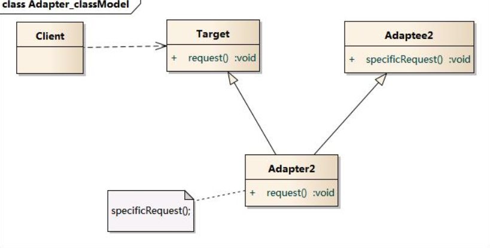
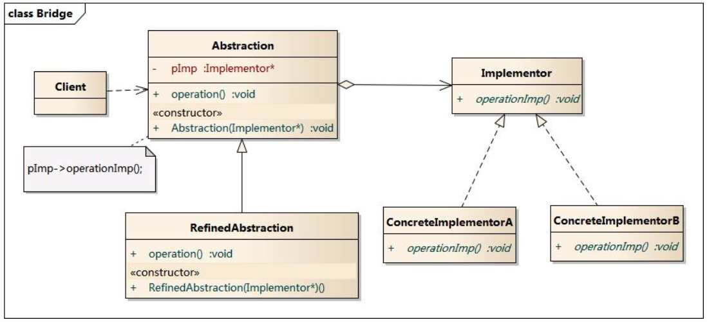
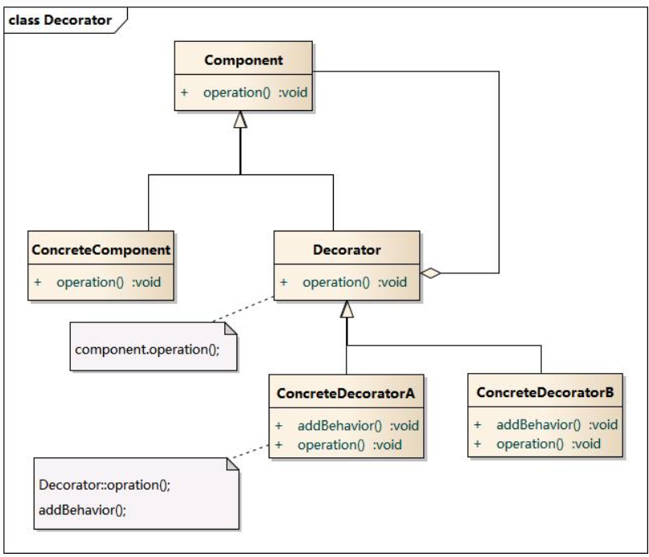
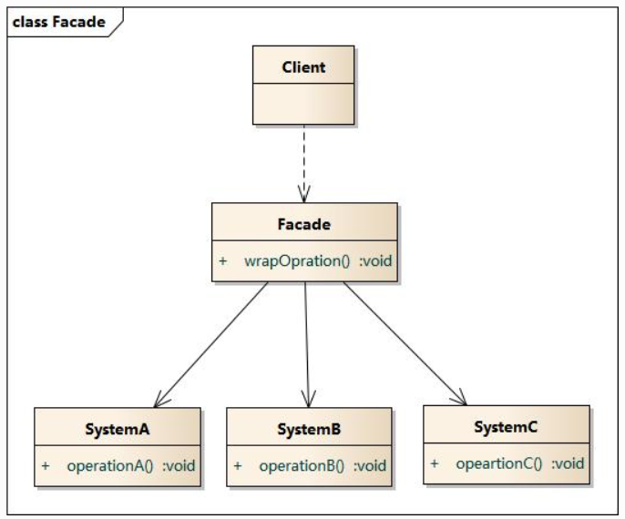
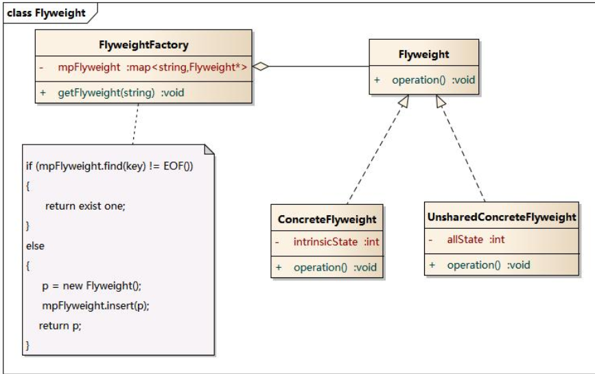
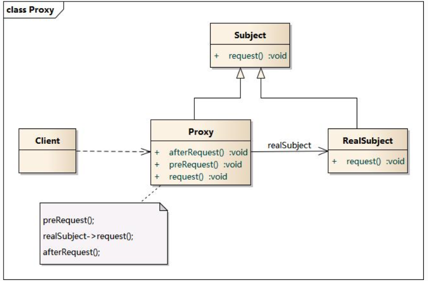

# 2. 结构型模式

结构型模式描述如何将类或对象结合在一起形成更大的结构

## 2.1 适配器模式 Adapter

1. 意图:  
   将一个类的接口转换成客户希望的另外一个接口，使得原来的接口不兼容而不能一起工作的类可以一起工作
2. 适用性：
   - 使用已经存在的类，但其接口不符合需求
   - 创建可以复用的类，该类可以与其他不相关的类或不可预见的类协同
   - 使用已经存在的子类，但是不可能对每个都进行子类化以匹配接口，对象适配器可以适配父类接口。
3. 实现要点  
   定义一个目的接口，可以通过继承或聚合被适配器类来实现

对象适配器
  
Adapter 关联 Adaptee(Adaptee 作为参数)，
Adapter 继承 Target，
Client 依赖 Target.

类适配器

## 2.2 桥接模式 Bridge

1. 意图：
   将抽象部分与实现部分分离，使他们都可以独立地变化。
2. 适用性：
   - 不希望在抽象和实现部分之间有一个固定的绑定关系
   - 类的抽象和实现都可以通过生成自雷的方法加以扩充
   - 对抽象的实现部分的修改应不会对客户产生影响
   - 对客户完全隐藏抽象的实现
   - 有许多类要生成
   - 在多个对象件共享实现，同时对客户隐藏这种实现机制
3. 实现要点：
   分别定义抽象的接口和实现的接口，抽象接口中聚合一个实现接口的引用，该引用就是连接接口和实现的桥梁。

[example](./src/bridge.java)

实例：跨平台播放器，可以播放多种格式。

## 2.3 装饰模式 Decorator

1. 意图：动态地给对象添加额外的职责，这种方式通过给子类添加职责会更为灵活。
2. 适用：
   - 在不影响其他对象的情况下，以动态、透明的方式给单个对象添加职责。
   - 处理那些可以撤销的职责。
   - 不能采用生成子类的方法进行扩充，如可能有大量独立地扩展，使得子类数目呈爆炸性增长。
3. 实现：类似于组合模式的实现策略，但目的是扩充类的职责。

ConcreteDecoratorA 继承 Decorator, Component 是 ConcreteDecoratorA 的构造函数的参数（聚合关系），
ConcreteDecoratorA 的 operation 先使用了继承的 Decorator 的 operation()，又增加了一条新的行为 addBehavior();  
实现了类的职责的扩充。

装饰模式动态地给一个对象增加更多的责任。  
通过配置文件，可以在运行时选择装饰器，实现不同的行为。  
[example](./src/decorator.py)

## 2.4 外观模式 Facade Pattern

1. 意图：
   为子系统提供统一的高层接口，该接口使得子系统更容易使用。
2. 适用：
   - 为复杂子系统提供一个简单的接口
   - 客户程序与抽象类的实现之间存在很大的依赖性
   - 构建一个层次结构的子系统
3. 实现要点：
   接口负责把请求转发给子系统中的其他对象

[facade.py](./src/facade.py)  
通过引入外观对象，使子系统的访问提供了简单的入口。降低 client 与子系统之间的耦合

缺点：  
不引入抽象外观类的情况下，新增子系统需要修改外观类或客户端代码，违背开闭原则。

## 2.5 享元模式 Flyweight

面向对象可以解决灵活性和扩展性问题，但同时引起对象过多时，性能下降问题。
享元通过共享技术实现相同或相似对象的重用。

1. 意图：运用共享技术实现大量细粒度的对象的复用
2. 适用性：
   - 应用程序适用了大量的对象，或造成很大的存储开销
   - 对象的多数状态可变为外部状态，当删除对象外部状态时，可相对较少的共享对象取代多组对象。
   - 应用程序不依赖对象标识
3. 实现要点：享元整体通过接口管理所有享元对象，客户类必须通过享元工厂访问享元对象

可以共享的内容称为内部状态 IntrinsicState  
不能共享的，需要外部环境设置的为外部状态 ExtrinsicState

享元工厂负责维护一个享元池 Flyweight Pool 用于存储具有相同内部状态的享元对象。
享元对象一般设计为较小的对象，它所包含的内部状态较少，这种对象也称为**细粒度对象**。

## 2.6 代理模式 Proxy

1. 意图
   客户不能直接引用一个对象，通过代理实现间接引用，代理可以去掉客户不能看到的内容和服务，或添加客户需要的服务。

2. 适用：

   - 需要用比较通用和复杂的对象指正替代简单的指针
   - 对实际对象的应用技术，以便释放它
   - 首次引用持久对象，需装入内存
   - 访问实际对象前，检查该对象是否已经被锁定，以确保其他对象不能改变它

3. 实现要点：
   代理类和被代理类继承于同一个接口，代理通过聚合被代理类

代理模式有以下几种类型：

- 远程代理 remote：为位于不同地址空间的对象提供本地代理对象
- 虚拟 virtual 代理：对与消耗资源较大的对象，线创建一个资源消耗小的对象表示，需要是才创建真实对象
- Copy-on-Write 代理：把复制操作延迟到客户端需要时进行。
- 保护 Protect or Access 代理：给不同用户提供不同级别的使用权限
- 缓冲 Cache 代理：为一个目标操作的结果提供临时存储空间，方便多个客户端共享
- 防火墙 Firewall 代理：保护目标不被恶意用户接近
- 同步化 Synchronization 代理：使多个用户同时使用一个对象而不产生冲突
- 智能引用 Smart Reference 代理：一个对象引用时提供额外的操作

[Previous page](1.FactoryPattern.md)
[Next page](3.BehavioralPattern.md)
