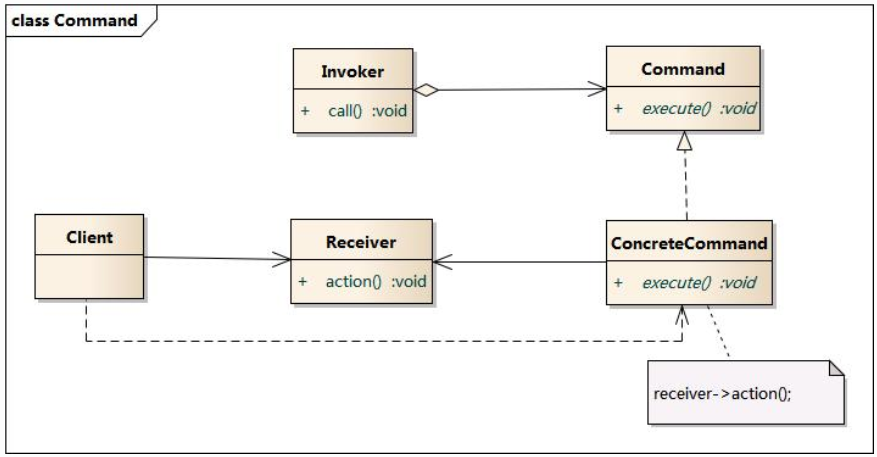
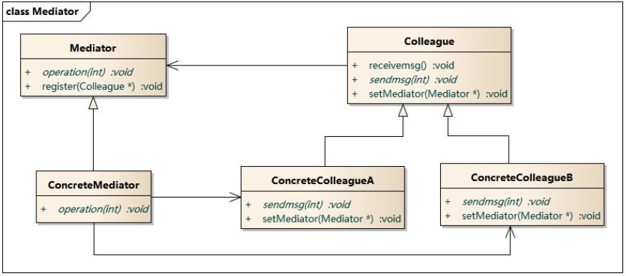
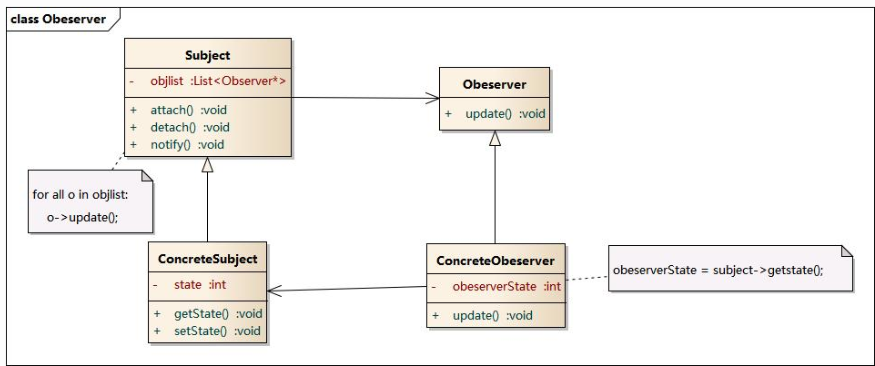
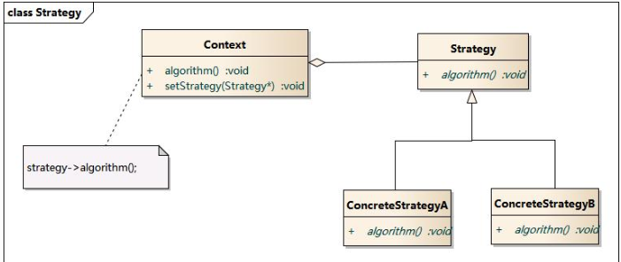
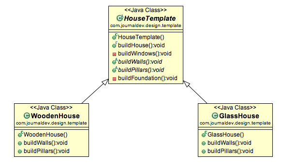
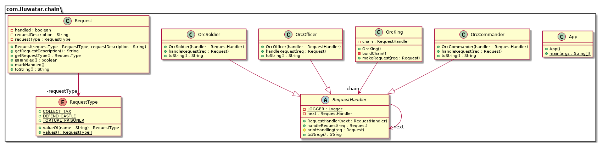

# 3. 行为型模式

行为型模式是对在不同的对象之间划分责任和算法的抽象化。
行为型模式分为：

- 类行为型模式：使用继承关系在几个类之间分配行为
- 对象行为型模式：使用对象的聚合关联关系分配行为

## 3.1 命令模式

1. 意图：
   请求的发送者和接受者之间完全解耦，二者之间没有之间的引用关系，发送请求的对象只需要如何发送请求，不需要知道如何完成请求。
2. 适用：
   - 抽象待执行动作以参数化某对象。（调用者和请求者解耦）
   - 在不同时刻指定、排列、执行请求
   - 支持撤销操作
   - 支持修改日志，当系统崩溃时这些修改可以重做。
   - 在构建在原语操作上的高层操作构造一个系统，从而提供了对事物进行建模的方法
   - 系统需要将一组操作组合在一起，支持宏命令
3. 实现要点：
   定义命令接口，具体的命令类可以决定如何处理请求。  
   [command.py](./src/command.py)

- Command:抽象命令类
- ConcreteCommand:具体命令类
- Invoker: 调用者
- Receiver: 接收者
- Client: 客户类

在调用者和接受者之间增加抽象命令类和命令类，使二者完全解耦。
新的命令可以很容易地加入到系统中。
可以比较容易设计一个命令队里和宏命令（组合命令）
可以方便地实现对请求的 undo 和 redo

## 3.2 中介者模式 Mediator

中介者模式：用一个中介对象来封装一系列的对象交互，中介者使各对象不需要显示地相互引用，从而使耦合松散，可以独立地改变他们之间的交互。中介者模式又称为调停者模式。

1. 意图：
   一个模块由多个对象组成，对象间存在相互引用，耦合度高。适用中介者模式可以降低耦合。
2. 适用性
   - 对象之间存在复杂的引用关系，产生的相互依赖关系混乱，难以理解
   - 一个对象由于引用了其他很多对象，导致难以复用
   - 通过一个中间类分装多个类中的行为，而又不想生成太多的子类，利用中介者，在中介者中定义对象。
3. 实现要点：
   定义中介者和协作者接口，中介者管理所有协作者之间的关系。

[mediator.py](./src/mediator.py)

对象之间的交互通过中介者实现，降低了对象之间的关系数量。  
中介者承担：

1. 中转作用：对象之间不需要显示地引用
2. 协调作用：中介者根据封装在自身内部的协调逻辑，将同事成员之间的额关系进行分离和封装。

## 3.3 观察者模式 Observer

观察者模式：定义对象之间的一种一对多的依赖关系，使得每当一个对象状态发生翻遍时，其相关依赖对象皆得到通知并自动更新。观察者模式又称为 Public-subscribe pattern, model-view pattern, source-listener pattern, dependents pattern.

1. 意图：
   一个对象发生改变时通知其他对象。
2. 适用：
   - 一个对象改变导致其他一个或多个对象发生改变
   - 一个对象必须要通知其他对象，但并不知道其他对象是谁
   - 一个抽象模型有两个方面，一个方面依赖另一个方面
   - 在系统中创建触发链
3. 实现要点：
   定义观察者和主题接口，具体的观察者通过注册机制，在具体的主体类中进行注册。

  
[observer.py](./observer.py)

观察者模式实现了表示层和数据逻辑层分离。
符合开闭原则。
观察者只知道目标对象发生了变化，不知道为什么发生变化。  
MVC 模式可以用观察者模式实现。Model 是被观察目标，View 是观察者，Controller 是中介者 Mediator，当模型数据改变时，视图相应改变。

## 3.4 状态模式

1. 意图：
   允许一个对象在其内部状态改变时改变它的行为，对象看起来似乎修改了它的类。
2. 适用性：
   - 对象的行为取决于他的状态，并在运行时根据状态改变行为，
   - 操作中含有**庞大的多分支**的条件语句，且这些分支依赖于该对象的状态。
3. 实现要点：
   定义状态接口，具体状态类中实现该状态对应的行为，上下文对象中聚合当前的状态。

例如：

封装了转换规则，增加状态只需要增加 newState()类，不需要修改 State, Content 类  
对象 content 状态改变后时，改变他的行为(content.getState().toString()), 对象 content 看起来像是修改了类。

- state 状态：  
  定义了根据不同状态进行不同处理的接口，该接口是那些处理内容依赖的方法集合。
- 具体的状态：  
  实现 state 接口
- context:
  持有当前状态的具体实例的实例，还定义了供外部使用者使用的状态模式的接口。

## 3.5 策略模式 Strategy

策略模式(Strategy Pattern)：定义一系列算法，将每一个算法封装起来，并让它们可以相互替换。策略模式让算法独立于使用它的客户而变化，也称为政策模式(Policy)。

1. 意图：
   解决一个问题有多种方法，可以根据不同环境选择不同的方法。
   定义一系列算法，封装起来，可以相互替换，从而使算法独立于使用他们的客户而变化。  
   每个封装算法的类称为策略
2. 适用性：
   - 系统里有许多类，区别仅是行为，使用策略模式可以动态选择行为
   - 一个系统需要在一种算法中选一种
   - 一个对象有许多行为，使用多重选择进行行为的选择
   - 不希望客户端知道算法是如何实现的，提供算法保密性和安全性
3. 实现要点：定义策略接口，具体策略类中实现具体的算法，上下文对象中聚合当前使用的策略。

[strategy.py](./src/strategy.py)

策略模式不决定选择什么算法，这有客户端决定。增加了灵活性，同时增加了客户端使用的难度。

## 3.6 模板方法 Template method

抽象类定义算法的骨架，子类实现细节。

buildHose()是模板方法，被 final 修饰，不能被覆写，定义了修改房子的逻辑。
子类通过修改 buildWall(), buildPillars()实现不同的子类。

[template.py](./src/template.py)

## 3.7 责任链 Chain of responsibility

为了避免发送者和接受者耦合，将接受者串起来，发送者沿着链条依次发送请求，直到发现有能够处理的接受者为止。

OrcKing 创建一个责任链 buildChain(),创建了 OrcCommander -> OrcOfficer -> OrcSoldier 的责任链，通过 makeRequest()响应请求。

[Previous page](2.StructuralPattern.md)
