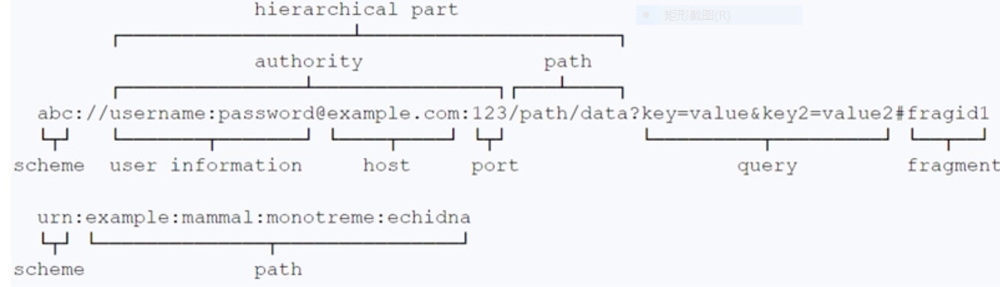

# 12. Web

java.net 包提供了实现网络应用的类。主要分为两大类：

1. Low level API
   - Addresses
   - Sockets
   - Intefaces
2. High level API
   - URIs: universal resource identifiers, 仅是标识符，没有访问资源的方法
   - URLs: universal resource locators，包含标识符和访问资源的方法
   - Connections：与 URLs 指向资源的连接
     - URLConnection 由 URL 创建的指向资源的连接
     - HttpURLConnection 是 URLConnection 的子类，提供了一些附加功能

## URI

类型：

1. Absolute URI: 有 schema 部分
2. 相对 URI: 没有指定 schema
3. Opaque URI：schema-special 部分不以'/'开始的绝对 URI
4. Hierarchical URI：schema-special 部分以'/'开始的绝对 URI,或者相对 URI

URI 的构成

- schema
- schema-special-part
- authority
- user-info
- host
- port
- path
- query
- fragment



对 URI 的操作：

- normalization： 去除不必要的'.','..'
- resolution: 根据 Base URI 将相对 URI 解析成绝对 URI
- relativization

8 位的转义字符可以出现在 user-info, path, query, fragment  
URI 创建，可以使用 springframework.web.util.UriComponentsBuilder 创建

```java
URI uri = new UriComponentsBuilder.fromUriString("http://localhost:8080").build(1);
```
