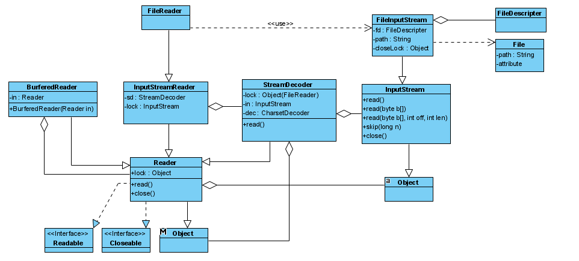
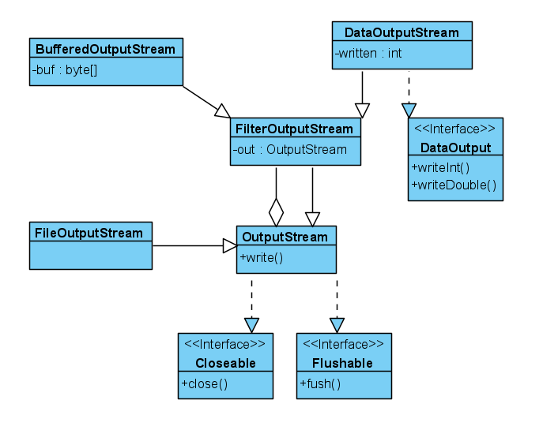

# 5. IO

## 1. Java 文件类

- java.io.Files 类

- NIO 包：Path, DirectoryStream, FileVisitor, FileSystem

File 类

- File(String pathname)
- createNewFile() 创建文件
- mkdirs() 创建目录
- exists() 目录或文件是否存在
- listFiles() 输出目录下的文件列表
-

## 2. 文件读写

OutputStream 抽象类 以 byte 为单位写入  
Writer 抽象类 以 char 为单位写入

写文件

- 创建文件，写入数据，关闭文件
- FileOutputStream 继承 OutputStream,
- OutputStreamWriter 继承抽象类 Writer
- BufferWriter 继承 Writer, 可以实现写字符，字符串数组，字符串的写入
  - write
  - newLine
- try-resource 语句自动关闭资源
- 关闭最外层的数据流，将将其上所有的数据流关闭。

InputStream 是字节流，以 byte 为单位读取  
Reader 是字符流，以 char 为单位读取
读文件

- FileInputStream
- InputStreamWriter
- BufferedReader 读到末尾返回 null
  - readLine

```java
public void writeFile {
  FileOutputStream fos = null;
  OutputStreamWriter osw = null;
  BufferedWriter bw = null;
  try{
    fos = new FileOutputStream("c:/temp/new.txt"); //结点类
    osw = new OutputStreamWriter(fos, "UTF-8"); //转化类
    bw = new BufferedWriter(osw); //装饰类
    // 或者 bw = new BufferedWriter(new OutputStreamWriter(new FileOutputStream("c:/new.txt)));
    bw.write("helle");
    bw.newLine();
    bw.write(" world");
  } catch(Exception ex) {
    ex.printStackTrace();
  } finally {
    try{
      bw.close(); //关闭最后一起，其他两个底层流也关闭
    } catch (Exception ex) {
      ex.printStackTrace();
    }
  }
}
```

读文件

```java
try (BufferedReader in = new BufferedReader(new InputStreamReader(new FileInputStream("pom.xml")))) {
    while ((line = in.readLine()) != null) {
        System.out.println(line);
    }
} catch (Exception e) {
    // TODO: handle exception
}
```

Reader:

- 读取字符 read():int 需要转字符串，到文档结尾返回-1
- 读到字符数组 read(char[] c)
  常用的 Reader:
- FileReader, 读取文件，内部持有一个 FileInputStream
- CharArrayReader 将一个数组变成一个 Reader，依次读取这个数组的内容
- StringReader 将一个字符串编程一个 Reader,依次读取这个字符串的每个字符。
- StreamReader 和 CharArrayReader 几乎一样
- InputStreamReader 转化器，可以将任意的 InputStream 转换为 Reader

Writer:

- FileWriter
- CharArrayWriter 构造一个缓冲区，依次写入数据，通过 toCharArray()获得字符串数组
- StringWriter 基于内存的 Writer, 内部维护了一个 StringBuffer
- OuputStreamWriter 将任意的 OuputStream 转换为 Writer 的转换器

PrintStream, PrintWriter
PrintStream 是一种 FileOuputStream, 在 OuputStream 接口上额外提供了一些写入各种数据的方法，常用的 System.out.println()就是使用 PrintStream 打印各种数据。  
和 OuputStream 相比，PrintStream 不会输出 IOException，所以不用捕获异常。
PrintWriter(Writer out)扩展了 Writer 接口，他的 print()/println()方法最终输出的是 char 数据。

BufferedReader 使用到了装饰模式，BufferedReader 继承 Reader，同时持有一个 Reader 对象 in，实现了对对象方法的扩充。  
这样就不用为每一种不同类型的 Reader 写一个 BufferedReader,降低了类的数量。

FileReader 继承 InputStreamReader, 简化了处理文件流类的创建过程。  
InputStreamReader 的 read 方法 S 调用 StreamDecoder 的 read 方法，StreamDecoder 的 read 方法又调用 InputStream 的 read 方法,并会根据文件的编码类型进程处理，将字节转化为字符。  
通过给 InputStreamReader 构造函数传入不同类型的 InputStream，用到了多态。  
使用 synchronized(lock)加锁。  
FileInputStream 调用 native 的方法：readBytes(), read0()等。


## DataStream

BufferedWriter 只支持写入单个字符，字符数组，字符串。不支持写入其他的数据类型，使用 DataStream 可以写入浮点型等数据类型。  
Data stream 支持基本的数据类型和 String 值。所有的数据流都继承于 DataInput 接口或 DataOutput 接口  
DataOutputStream 打开了一个输出流，DataOutputStream 只能为现有的字节流创建一个包装。所以这里 DataOutputStream 使用到了装饰模式。  
常用的方法有：

- writeDouble(), readDouble()
- writeInt() int 32 位，byte 8 位，所以需要调用输出流的 write 方法 4 次, readInt()
- writeUTF(), readUTF()

DataOutputStream 使用到了适配器模式，通过继承 FilterOutputStream 和 DataOutput, 将输出流类转换为符合 DataOutput 接口的类。
FilterOutputStream 使用到了装饰模式，它是扩展输出流的装饰器。


## 3. 二进制文件读写

## 4. System.in System.out

## 异常

关闭文件失败会抛出 IOException 异常  
EOFException 继承 IOException 异常，表示在输入文件时意外到达文件结尾或流的结尾。
