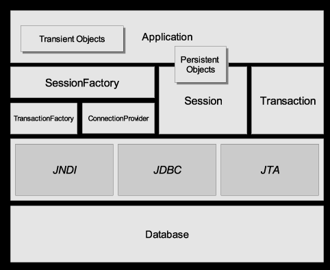
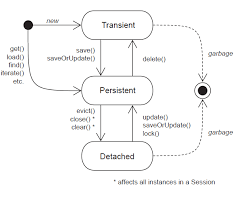

# 7. Hibernate

Hibernate是对象关系映射框架(ORM object relation mapping)，它对JDBC进行了轻量级的封装，使程序员可以用面向对象思想操作数据库。

## 7.1 基本概念
### 7.1.1 ORM
ORM一般包括以下几个部分
1. 一个对持久类对象进行CRUD操作的API
2. 一个语言或API用来规定与类和类属性相关的查询
3. 一个规定mapping metadata的工具
4. 一种技术可以让ORM的实现同时事务一起进行dirty checking, lazy association fetching以及其他优化操作

### 7.1.2 Hibernate核心接口
1. Session  
  session可以看做是介于数据连接和事务管理之间的一种中间接口，包含一些持久层相关的操作，如存储持久对象到数据库，从数据库获取数据。
2. SessionFactory  
  初始化Hibernate, 负责创建session, 使用了工厂模式。
3. Transaction  
  Transaction接口负责事务相关操作，一般在增删改中出现。更多人会用spring管理事务
4. Query  
  负责数据库查询操作
5. Configuration  
  用于配置并启动Hibernate

  

### 7.1.3 对象的状态
需要被持久化的java对象，在它的生命周期中有以下三种状态：
1. 瞬时状态transient  
  用new创建，还没有持久化，不在session缓存中
2. 持久化状态presistent  
  已被持久化，加入到了session缓存中
3. 托管状态detached  
  已被持久化，但不再处于session缓存中  
  

### 7.1.4 Hibernate事务
数据库事务是指由一个或多个SQL语句组成的工作单元，这个工作单元的SQL语句相互依赖，如果有一个SQL语句执行失败，则必须撤销整个工作单元

Hibernate控制事务方法：
1. 手动模式：使用不带参的openSession方法，Session自动把连接设置为手动模式  
  Session session = sessionFactory.openSession();
  或者：  
  connection.setAutoCommit(false);  
  Session session = sessionFactory.openSession(connection);
2. 声明事务开始边界  
  Transaction tx = session.beginTransaction();
3. 提交事务  
  tx.commit();
4. 撤销事务
  tx.rollback();