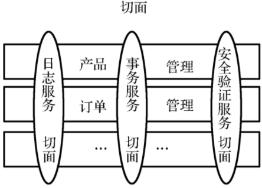

# 8. Spring2

## 8.1 Spring 概述

Spring 采用了控制反转 IoC 和 AOP 面向切面编程技术。
Spring 是轻量级的框架。

1. IoC 容器：  
   依赖的对象是在程序运行期间由容器创建和销毁，容器控制依赖对象的生命周期，称为控制反转 Inversion of Control，它使对象之间实现了松耦合。
2. AOP 实现  
   面向切面编程 AOP 可以将程序的业务代码和系统服务代码（如事务管理，日志记录）分离开，在业务逻辑完全不知道的情况下为其提供系统服务。这样业务逻辑只需要负责和业务处理相关的操作，不需要关心系统服务问题。

## 8.2 IoC

### IoC 注解

@Autowired  
对类成员变量、方法及构造函数进行标注，完成自动装配  
byType 方式，即通过属性查找 JavaBean 依赖的对象并为其注入。

@Qualifier  
属性有多个候选时，通过@Qualifier 指定注入 bean 的名称

@Resource  
和@Autowired 类似，区别是@Resource 是按 byName 自动注入。

@Component  
可以省略在 XML 文件中定义 Bean  
如果不指定名称，则名称为小写字母开头的类名。  
在 XML 配置文件中加入<context:component-scan base-package="annotation">，表示扫描 annotion 类包及递归子包中的所有类，根据注解产生并注入需要的 Bean

## 8.3 AOP

一个系统中各功能那个模块是相互并列的形式，各功能模块都需要日志服务，事务服务等，通过将这些共用的服务分离出来，进而在改变这些行为的时候不影响业务逻辑的代码。



### 8.3.1 AOP 术语

1. 关注点 concern: 与所关注业务无关的公共服务
2. 连接点 join point：程序执行过程中，需要添加关注点功能的点。
3. 切面 aspect： 将各个业务对象之间的关注点收集起来，设计成独立，可重用，职责清楚的对象，称为切面
4. 通知 advice：切面在程序运行到某个连接点时所触发的动作
5. 目标对象 target object：一个通知被应用的对象或目标
6. 织入 weaving：把切面连接到目标对象上的过程
7. 切入点 pointcut：匹配连接点的断言。

### 8.3.2 AOP 原理

AOP 使用了代理模式

1. 静态代理

```java
//userManager.java 数据库访问接口
public interface UserManager {
    public void addUser(String username, String password);
}
//UserManagerImpl.java 数据库访问实现类
public class UserManagerImpl implements UserManager {
    @Override
    public void addUser(String username, String password){
        System.out.println("user added");
    }
}
//UserManagerImplProxy.java 代理类
public class UserManagerImplProxy implements UserManager {
    private UserManager userManager;
    public UserManagerImplProxy(UserManager userManager) {
        this.userManager = user.Manager;
    }
    @Override
    public void addUser(String username, String password) {
        System.out.println("addUser start");
        userManager.addUser(username, password);
    }
}
//Test.java 测试类
public class Test {
    public static void main(String[] args) {
        UserManager userMgr = new UserManagerImpl();
        UserManagerImplProxy proxy = new UserManagerImplProxy(userMgr);
        proxy.addUser("admin","123");
    }
}
```

2. 动态代理  
   静态代理**不能实现切面类和代理类的分离**，代理类需要对每个方法添加自己的逻辑。  
   Spring AOP 框架对 AOP 代理类的处理方法：如果目标对象实现了接口，Spring AOP 将会采用 JDK 动态代理来生成 AOP 代理类，如果目标对象没有实现接口，则无法使用 JDK 动态代理，则采用 CGLib 生成 AOP 代理类。  
   与静态代理不同，动态代理的代理类由 JDK 提供

使用 java.lang.reflect.proxy 类创建动态代理类实例

```java
public static Object newProxyInstance(ClassLoader loader, Class<?>[] interface, InvocationHander h) throws IllegalArgumentException
```

InvocationHander 指派方法调用的调用处理程序

```java
//创建代理对象的调用处理程序（拦截程序）
//TransactionHander.java
public class TransactionHander implements InvocationHander {
    private Object target;
    //绑定被代理对象并返回代理类
    public Object bind(Object target) {
        this.target = target;
        return Proxy.newProxyInstance(target.getClass().getClassLoader, target.getClass().getInterfaces(), this);
    }
    //通过回调方法Invoke()，在执行代理类的方法的时候，会加上日志操作。实现切面类和代理类分离。
    //这样给新的实现类加上日志操作就不用重写代理类了。
    @Override
    public Object invoke(Object proxy, Method method, Object[] args) throws Trowable {
        Object result = null;
        System.out.println("begin");
        result = method.invoke(target, args);
        System.out.prinln("end");
        return result;
    }
}
//TestJdkProxy.java
public classs TestJdkProxy {
    public static void main (String[] args) {
        TransactionHander hander = new TransactionHander();
        UserManager proxy = (UserManager)hander.bind(new UserManagerImpl());
        proxy.addUser("admin","123");
    }
}
```

3. CGLib 代理  
   JDK 动态代理的限制是对象必须实现一个或多个接口。如果类没有接口，则使用 CGLib(Code Generation Library)实现动态代理。

```java
//UserManagerImpl.java 没有接口
public class UserManagerImpl {
    public void addUser(String username, String password){
        System.out.println("user added");
    }
}

//TransactionInterceptor.java 拦截程序
public class TransactionInterceptor implements MethodInterceptor {
    private Object target;
    public Object bind(Object target) {
        this.target target;
        Enhancer enhancer = new Enhancer();
        enhancer.setSupperclass(this.target.getClass());
        enhancer.setCallback(this);
        return enhancer.create();   //产生动态代理类
    }

    @Override
    public Object intercept(Object obj, Method method, Object[] args, MethodProxy proxy) throws Trowable {
        Object result;
        System.out.println("begin");
        result. = proxy.invokeSuper(obj, args); //类似JDK的invoke()方法
        System.out.println("send");
        return result
    }
}
```

## 8.4 AOP 框架

### 8.4.1 Advice

Spring 提供的 Advice 类型：

- Before Advice
- After Advice
- Around Advice
- Throw Advice

Spring 使用 Around 通知类，需要实现接口 MethodInterceptor, 在 lib/aopalliance/aopalliance.jar 文件

1. 创建接口和实现接口的目标类
2. 创建 Advice 类 AroundInterceptor.java

```java
public class AroundInterceptor implements MethodInterceptor {
    @Override
    public Object invoke(MethodInovation invocation) throws Throwable {
        System.out.println("Before " + invocation.getMethod().getName());
        Object returnValue = invocation.proceed(); //调用目标对象的方法
        System.out.println("After " + invocation.getMethod().getName());
        return returnValue;
    }
}
```

3. 创建测试程序

   - 编码方法

   ```java
   private void testNoIoC {
       ProxyFanctory proxyFactory = new ProxyFanctory();   //创建代理工厂
       proxyFactory.addAdvice(new ArroundInterceptor());   //指定拦截程序
       proxyFactory.setTarget(new UserManagerImpl());  // 设定目标类

       UserManager proxy = (UserManager) proxyFanctory.getProxy(); //产生代理对象
       proxy.addUser("admin","123");   //通过代理对象调用目标方法
   }
   ```

   - IoC 容器注入

   ```XML
   <!-- bean.xml -->
   <bean id="aroundAdvice" class="advice.AroundInterceptor"/>
   <bean id="userManagerImpl" class="advice.UserManagerImpl"/>
   <!-- 代理 -->
   <bean id="proxyfactory" class="org.springframework.aop.frameework.ProxyFactoryBean">
       <!-- 目标对象实现接口 -->
       <property name="proxyInterfaces">
           <value>advice.UserManager</value>
       </property>
       <!-- 目标对象 -->
       <property name="target" ref="userManagerImpl"/>
       <!-- 配置切面 -->
       <property name="interceptorNames">
           <value>aroundAdvice</value>
       </property>
   </bean>
   ```

   ```java
   private void testByIoC {
       ApplicationContext context = new FileSystemXmlApplicationContext("classpath:/advice/bean.xml");
       UserManager proxy = (UserManager) context.getBean("proxyfactory");
       proxy.addUser("admin","123")
   }
   ```

### 8.4.2 Pointcut Advisor

将 Advisor 织入到目标对象的某些方法。  
将 Pointcut 和 Advisor 结合起来，充当 Advice 和 Pointcut 之间的适配器，指定某个时机织入什么 Advice，称为 PointcutAdvisor。  
常用的 PointcutAdvisor 有 NameMatchMethodPointcutAdvisor 和 RegexMethodPointcutAdvisor.

### 8.4.3 Introduction

引入通知 Introduction Advice 可以在不修改对象源代码的情况下，为目标对象动态地添加方法。

## 8.5 Spring 中的 AOP

### 8.5.1 基于 XML Schema 的设置

所有的 Spring AOP 配置都必须定义在<aop:config>元素内部，可以包含 pointcut advisor, aspect  
先定义一个 logger bean，然后创建一个<aop:aspect>元素引用该 bean, 这样就声明了一个切面。

```xml
<bean id="logger" class="xmlschema.LoggerAspect"/>
<aop:config>
    <aop:aspect id="loggerAspect" ref="logger">
    </aop:aspect>
</aop:conifg>
```

声明切入点<aop:pointcut>

```xml
<bean id="userManager" class="xmlschema.UserManagerImpl"/>
<bean id="logger" class="xmlschema.LoggerAspect"/>
<aop:config>
    <!-- 声明切面 -->
    <aop:aspect id="loggerAspect" ref="logger">
        <!-- 声明切入点 所有的add开头的方法前切入 -->
        <aop:pointcut expression="execution(* xmlschema.UserManagerImpl.add*(..))" id="logPointcut"/>
        <!-- 声明通知Advice -->
        <aop:before method="before" pointcut-ref="logPointcut"/>
        <aop:after method="after" pointcut-ref="logPointcut"/>
    </aop:aspect>
</aop:conifg>
```

声明通知<aop:advice>

```xml
<bean id="userManager" class="xmlschema.UserManagerImpl"/>
<bean id="logger" class="xmlschema.LoggerAspect"/>
<aop:config>
    <aop:aspect id="loggerAspect" ref="logger">
    </aop:aspect>
</aop:conifg>
```

### 8.5.2 基于 Annotation 的支持

Spring2 支持 AspectJ 注解，AspectJ 可以看做是 Java 语言的拓展，是一个面向对象的框架。

1. @AspectJ 声明切面

```java
@Component("logger")
@Aspect
public class LoggerAspect{....}
```

2. 声明切入点 Pointcut

```java
@Component("logger")
@Aspect
public class LoggerAspect {
    @Pointcut("execution(* annotation.UserManagerImpl.add*(..))") //切点表达式
    public void startWithAdd() {
        // 切点方法前面，可以被多个通知共享。
    }
    // 在所有的add开头的方法或del开头的方法前切入
    @Pointcut("execution(* *.add*(..)) || execution(* *.del*(..))")
    private void startWithDel() {}
}
```

3. 声明通知 Advice
   AspectJ 支持的 5 种通知类型

- @Before
- @After
- @AfterReturning 方法返回之后
- @AfterThrowing 方法抛出异常之后
- @Around 环绕着方法执行

@Component("logger")
@Aspect
public class LoggerAspect {
@Pointcut("execution (_ annotation.UserManagerImpl.add_(..))")
public void startWithAdd(){}
@Before("execution (_ annotation.UserManagerImpl.del_(..))")
public void before(JoinPoint jp) {
System.out.println("Before: " + jp.toShortString());
}
@After("startWithAdd")
public void after(JoinPoint jp) {
System.out.println("After: " + jp.toShortString());
}
}
