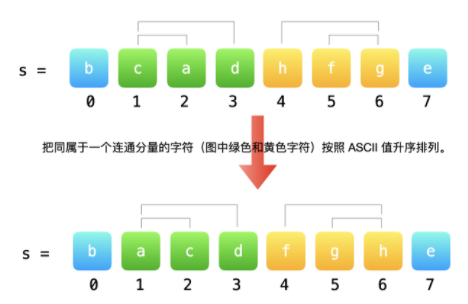
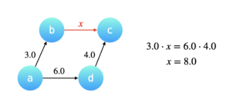

## 1. 并查集

### 1.1 基本概念

### 1.2 应用

### 1.2.1 交换字符串中的元素

给你一个字符串 s，以及该字符串中的一些「索引对」数组 pairs，其中 pairs[i] = [a, b] 表示字符串中的两个索引（编号从 0 开始）。

你可以 任意多次交换 在 pairs 中任意一对索引处的字符。

返回在经过若干次交换后，s 可以变成的按字典序最小的字符串。

示例 1:

```
输入：s = "dcab", pairs = [[0,3],[1,2],[0,2]]
输出："abcd"
解释：
交换 s[0] 和 s[3], s = "bcad"
交换 s[0] 和 s[2], s = "acbd"
交换 s[1] 和 s[2], s = "abcd"
```

解题要点：

1. 索引对存在并集关系，考虑使用并查集。

2. 具有相同父节点的节点（同一连通分量），按照 ASCII 码排序，使用优先队列排序 PriorityQueue 的 offer()方法和 poll()方法输出。

3. 使用 HashMap 将字符串分成具有相同 parent 的几个部分

4. 使用 StringBuilder.append()将每个字符合成字符串，使用 toString()方法输出字符串。

   

   ```java
   class UnionFind {
       private int[] parent;
       //结点的高度， 1为根节点，递增
       private int[] rank;
       public UnionFind(int n) {
           this.parent = new int[n];
           this.rank = new int[n];
           for(int i = 0; i < n; i++){
               this.parent[i] = i;
               this.rank[i] = 1;
           }
       }
       public void union(int x, int y) {
           int rootX = find(x);
           int rootY = find(y);
           if(rank[rootX] == rank[rootY]) {
               parent[rootX] = rootY;
               //以rootY作为根节点，树的高度增加
               rank(rootY)++;
           } else if(rank[rootX] < rank[rootY]) {
               //rootY的高度比rootX的高，则树的高度不变
               parent[rootX] = root[Y];
           } else {
               //树的高度不变
               parent[rootY] = rootX;
           }
       }
       public int find(int x) {
           if(x!=parent[x]) {
               parent[x] = find(x);
           }
           return parent[x];
       }
   }
   ```

   

[Smallest String With Swaps](./SmallestStringWithSwaps/Main.java)

### 1.2.2 除法求值

给你一个变量对数组 equations 和一个实数值数组 values 作为已知条件，其中 equations[i] = [Ai, Bi] 和 values[i] 共同表示等式 Ai / Bi = values[i] 。每个 Ai 或 Bi 是一个表示单个变量的字符串。

另有一些以数组 queries 表示的问题，其中 queries[j] = [Cj, Dj] 表示第 j 个问题，请你根据已知条件找出 Cj / Dj = ? 的结果作为答案。

返回 所有问题的答案 。如果存在某个无法确定的答案，则用 -1.0 替代这个答案。如果问题中出现了给定的已知条件中没有出现的字符串，也需要用 -1.0 替代这个答案。

注意：输入总是有效的。你可以假设除法运算中不会出现除数为 0 的情况，且不存在任何矛盾的结果。

示例 1：

```
输入：equations = [["a","b"],["b","c"]], values = [2.0,3.0], queries = [["a","c"],["b","a"],["a","e"],["a","a"],["x","x"]]
输出：[6.00000,0.50000,-1.00000,1.00000,-1.00000]
解释：
条件：a / b = 2.0, b / c = 3.0
问题：a / c = ?, b / a = ?, a / e = ?, a / a = ?, x / x = ?
结果：[6.0, 0.5, -1.0, 1.0, -1.0 ]
```

**要点**：

1. 具有相同分母的可以进行合并。分子可以转化成分母的倍数。数组queries具有数组合并关系，考虑使用并查集。

2. 可以构成一个有向图，箭头指向分母，合并操作可以实现路径压缩

   

```java
public class UnionFind{
    private int[] parent;
    //子结点指向父节点路径上的权值，
    private double[] weight;
    public UnionFind(int n) {
        parent = new int[n];
        weight = new double[n];
        for(int i = 0; i<n; i++) {
            parent[i] = i;
            weight[i] = 1.0d;
        }
    }
    public void union(int x, int y, double value) {
        int rootX = parent[x];
        int rootY = parent[y];
        if(rootX == rootY) {
            return;
        } else {
            parent[rootX] = rootY;
            weight[rootX] = weight[y] / weight[x] * value;
        }
    }
    private int find(int x) {
        if(parent[x] != x) {
            int origin = parent[x];
            parent[x] = find(origin);
            //路径上的权值连乘 实现了路径压缩
            weight[x] = weight*weight[origin];
        }
        return parent[x];
    }
    public double isConnected(int x, int y) {
        int rootX = find(x);
        int rootY = find(y);
        if(rootX == rootY) {
            return weight[x] / weight[y];
        } else {
            return -1d;
        }
    }
}
```

[Division](./Division/Division.java)